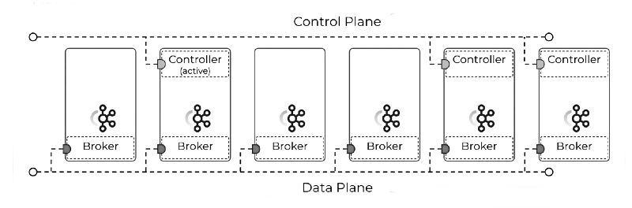
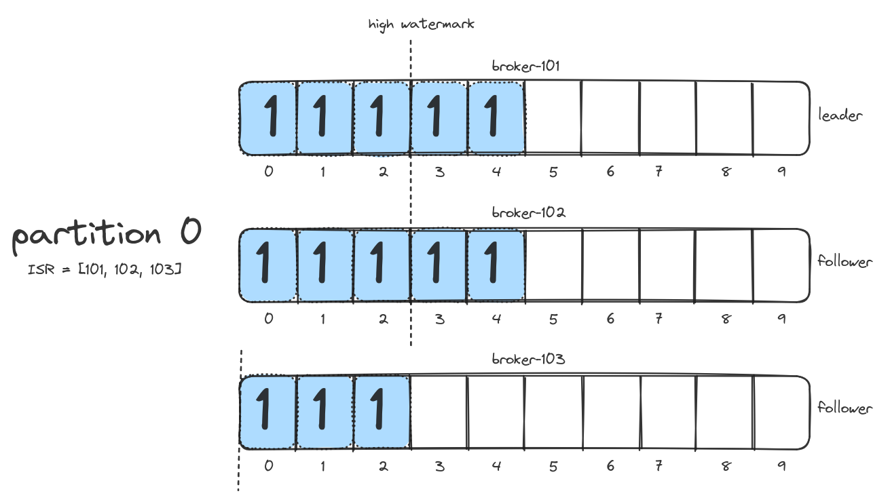

## Kafka cluster deployments and tools

[Apache Kafka](https://kafka.apache.org) is an Open Source distributed event streaming platform that lets you read,
write, store, and process events (also called records or messages) across many
machines. [Red Hat AMQ Streams](https://www.redhat.com/en/resources/amq-streams-datasheet) includes Kafka and a set of
operators from the [CNCF Strimzi](https://strimzi.io) project. The operators are a way of extending the OpenShift or
Kubernetes platforms by deploying application controllers with domain knowledge.

Let's start by saying that not every use case justifies the additional complexity that Kafka brings to the table. It is
best suited when you have a high throughput of relatively small messages, that traditional message brokers struggle to
manage, or you have near realtime stream processing requirements.

Kafka provides two main layers that can scale independently: the **storage layer**, which stores messages efficiently in
a cluster of brokers, and the **compute layer** which is built on top of the producer and consumer APIs. There are also
two higher level APIs: the connect API for external systems integration and the streams API for stream processing.

Within a cluster, we have the **control plane**, which handles cluster metadata and the **data plane**, which handles
user data. One of the brokers is elected as controller, which has the additional responsibility of managing the states
of partitions and replicas and for performing administrative tasks like reassigning partitions. In ZooKeeper mode there
is only one elected controller, while in the new KRaft mode we have a quorum of controllers, where only one is active at
any time, while the others are ready to take over in case of failure.



Kafka uses a **binary protocol over TCP** (KRPC). The protocol defines APIs as request/response message pairs and
includes both the message format and error codes. Clients send messages in the exact same binary format that brokers
write to disk. The protocol is backwards and forwards compatible, however there can be issues in case of message format
changes. This hasn't happened for a long time, but there is no guarantee. Typically, every client opens N+1 connections,
where N is the number of brokers in the cluster and 1 connection is for metadata updates. Client requests are processed
in the same order they are sent.

Each message is modeled as a **record** with timestamp, key, value and optional headers. Key and value are just byte
arrays and this gives people the flexibility to encode the data in whatever format they want, using their favourite
serializer. The timestamp is always present, but it can be set by the application when it sends (default), or by the
Kafka runtime when it receives. Whenever possible, records are buffered and sent in **batches** (a single request can
include multiple batches, one for each partition).

Records are stored in a **topic**, which is further divided into one or more **partitions**, distributed evenly across
the brokers. Each partition is stored on disk as a series of fixed-size commit logs called **segments**. Ordering is
only guaranteed at the partition level. Each record within a partition has a unique id called the **offset**, which is a
monotonically increasing number that is never reused. To uniquely identify a record in Kafka you need the topic, the
partition and the offset. The last committed offset of a partition is called the **high watermark** (HW). Records are
guaranteed to be fully replicated up to this offset. Only committed records are exposed to consumers.



By default, Kafka relies on the OS page cache for disk writes and there is no fsync call (except for the new KRaft
internal metadata topic). Durability and high availability can be achieved through **partition replication** and
appropriate client configuration (topic with `replicas=3` and `min.insync.replicas=2`, producer with `acks=all`). The
broker will only acknowledge the produce request once the data is fully replicated across other brokers. If you set a
topic replication factor of N, the system can tolerate N-1 broker failures.

Producers always send to the **leader** partition replica, while consumers can be configured to fetch from a
**follower**. Up to date replicas are called **in-sync replicas** (ISR). Multiple consumers with the same `group.id`
form a **consumer group** and partitions are distributed among them using a pluggable assignor (partition as unit of
parallelism). Within a consumer group, a partition is assigned to exactly one consumer to not break ordering, but that
consumer can handle multiple partitions. Each consumer periodically or manually commits its position (next offsets to
read) to an internal topic called `__consumer_offsets`.

### Example: deploy on localhost

We are going to deploy a Kafka cluster on your local machine. This is useful for quick tests where a multi node cluster
is not required. We will use the latest upstream release because the downstream release is just a rebuild with few
additional and optional plugins.

Download the Kafka distribution and start a single broker cluster all in one command. When it returns, you should have
two processes running on your system, one is Kafka and the other is ZooKeeper.

```sh
$ KAFKA_URL="https://archive.apache.org/dist/kafka/3.2.1/kafka_2.13-3.2.1.tgz" \
  && rm -rf /tmp/kafka-logs /tmp/zookeeper \
  && export KAFKA_HOME=$(mktemp -d -t kafka-XXXXXXX) && export PATH="$KAFKA_HOME/bin:$PATH" \
  && curl -sLk $KAFKA_URL | tar xz -C $KAFKA_HOME --strip-components 1 \
  && zookeeper-server-start.sh -daemon $KAFKA_HOME/config/zookeeper.properties \
  && sleep 5 && kafka-server-start.sh -daemon $KAFKA_HOME/config/server.properties

$ jps -v | grep kafka
451178 Kafka -Xmx1G -Xms1G -XX:+UseG1GC -XX:MaxGCPauseMillis=20 -XX:InitiatingHeapOccupancyPercent=35 -XX:+ExplicitGCInvokesConcurrent -XX:MaxInlineLevel=15 -Djava.awt.headless=true -Xlog:gc:file=/tmp/kafka-uIdD8ek/bin/.logs/kafkaServer-gc.log:time,tags:filecount=10,filesize=100M -Dcom.sun.management.jmxremote -Dcom.sun.management.jmxremote.authenticate=false -Dcom.sun.management.jmxremote.ssl=false -Dkafka.logs.dir=/tmp/kafka-uIdD8ek/bin/.logs -Dlog4j.configuration=file:/tmp/kafka-uIdD8ek/bin/.config/log4j.properties
450808 QuorumPeerMain -Xmx512M -Xms512M -XX:+UseG1GC -XX:MaxGCPauseMillis=20 -XX:InitiatingHeapOccupancyPercent=35 -XX:+ExplicitGCInvokesConcurrent -XX:MaxInlineLevel=15 -Djava.awt.headless=true -Xlog:gc:file=/tmp/kafka-uIdD8ek/bin/.logs/zookeeper-gc.log:time,tags:filecount=10,filesize=100M -Dcom.sun.management.jmxremote -Dcom.sun.management.jmxremote.authenticate=false -Dcom.sun.management.jmxremote.ssl=false -Dkafka.logs.dir=/tmp/kafka-uIdD8ek/bin/.logs -Dlog4j.configuration=file:/tmp/kafka-uIdD8ek/bin/.config/log4j.properties
```

Create a new topic with 3 partitions, produce and consume some messages. When consuming messages, we print additional
data such as the partition number. Every consumer with the same `group.id` will be part of the same consumer group. If
you don't use the `--group` option, a randomly generated `group.id` is used at every invocation.

```sh
$ kafka-topics.sh --bootstrap-server :9092 --topic my-topic --create --partitions 3 --replication-factor 1 
Created topic my-topic.

$ kafka-topics.sh --bootstrap-server :9092 --topic my-topic --describe
Topic: my-topic	TopicId: a4Lnw1iQSW6MALg0gvxZNQ	PartitionCount: 3	ReplicationFactor: 1	Configs: segment.bytes=1073741824
	Topic: my-topic	Partition: 0	Leader: 0	Replicas: 0	Isr: 0
	Topic: my-topic	Partition: 1	Leader: 0	Replicas: 0	Isr: 0
	Topic: my-topic	Partition: 2	Leader: 0	Replicas: 0	Isr: 0

$ kafka-console-producer.sh --bootstrap-server :9092 --topic my-topic --property parse.key=true --property key.separator="#"
>1#hello
>2#world
>^C

$ kafka-console-consumer.sh --bootstrap-server :9092 --topic my-topic --group my-group --from-beginning \
  --property print.partition=true --property print.offset=true --property print.key=true
Partition:0	Offset:0	1	hello
Partition:2	Offset:0	2	world 
^CProcessed a total of 2 messages
```

It works, but where these messages are being stored? The broker property `log.dirs` configure where our topic partitions
are stored. We have 3 partitions, which corresponds to exactly 3 folders on disk.

```sh
$ cat $KAFKA_HOME/config/server.properties | grep log.dirs
log.dirs=/tmp/kafka-logs

$ ls -lh /tmp/kafka-logs/ | grep my-topic
drwxr-xr-x. 2 fvaleri fvaleri  140 Sep  8 16:55 my-topic-0
drwxr-xr-x. 2 fvaleri fvaleri  140 Sep  8 16:55 my-topic-1
drwxr-xr-x. 2 fvaleri fvaleri  140 Sep  8 16:55 my-topic-2
```

The consumer output shows that messages were sent to partition 0 and 2. Looking inside partition 0, we have a `.log`
file containing our records (each segment is named after the initial offset), an `.index` file mapping the record offset
to its position in the log and a `.timeindex` file mapping the record timestamp to its position in the log. The other
two files contain some additional metadata.

```sh
$ ls -lh /tmp/kafka-logs/my-topic-0/
total 12K
-rw-r--r--. 1 fvaleri fvaleri 10M Sep  8 16:55 00000000000000000000.index
-rw-r--r--. 1 fvaleri fvaleri  74 Sep  8 16:57 00000000000000000000.log
-rw-r--r--. 1 fvaleri fvaleri 10M Sep  8 16:55 00000000000000000000.timeindex
-rw-r--r--. 1 fvaleri fvaleri   8 Sep  8 16:55 leader-epoch-checkpoint
-rw-r--r--. 1 fvaleri fvaleri  43 Sep  8 16:55 partition.metadata
```

Partition log files are in binary format, but Kafka includes a dump tool for decoding them. On this partition we have
one batch (`baseOffset`), containing only one record (`| offset`) with key "1" and value "hello".

```sh
$ kafka-dump-log.sh --deep-iteration --print-data-log \
  --files /tmp/kafka-logs/my-topic-0/00000000000000000000.log
Dumping /tmp/kafka-logs/my-topic-0/00000000000000000000.log
Starting offset: 0
baseOffset: 0 lastOffset: 0 count: 1 baseSequence: 0 lastSequence: 0 producerId: 0 producerEpoch: 0 partitionLeaderEpoch: 0 isTransactional: false isControl: false deleteHorizonMs: OptionalLong.empty position: 0 CreateTime: 1662649069768 size: 74 magic: 2 compresscodec: none crc: 3775885203 isvalid: true
| offset: 0 CreateTime: 1662649069768 keySize: 1 valueSize: 5 sequence: 0 headerKeys: [] key: 1 payload: hello
```

Our consumer group should have committed the offsets to the `__consumer_offsets` internal topic. The problem is that
this topic has 50 partitions by default, so how do I know which partition was used? Kafka uses a simple hashing
algorithm to map a `group.id` to a specific offset coordinating partition. We can use the same algorithm through a
simple bash function (JDK 9+ is required).

```sh
$ find_cp() {
  local id="$1"
  local part="${2-50}"
  if [[ -n $id && -n $part ]]; then
    echo 'public void run(String id, int part) { System.out.println(abs(id.hashCode()) % part); }    
      private int abs(int n) { return (n == Integer.MIN_VALUE) ? 0 : Math.abs(n); } 
      run("'$id'", '$part');' \
      | jshell -
  fi
}

$ find_cp my-group
12
```

We know that the consumer group commit record was sent to `__consumer_offsets-12`, so let's dump this partition too.
Here values are encoded for performance reasons, so we have to pass the `--offsets-decoder` option.

This partition contains other metadata, but we are specifically interested in the `offset_commit` key. We have a batch
from our consumer group, which includes 3 records, one for each input topic partition. As expected, the consumer group
committed offset1 on partition0 and partition2, plus offset0 on partition1 (we sent 2 messages).

```sh
$ kafka-dump-log.sh --deep-iteration --print-data-log --offsets-decoder \
  --files /tmp/kafka-logs/__consumer_offsets-12/00000000000000000000.log
Dumping /tmp/kafka-logs/__consumer_offsets-12/00000000000000000000.log
Starting offset: 0
...
baseOffset: 15 lastOffset: 17 count: 3 baseSequence: 0 lastSequence: 2 producerId: -1 producerEpoch: -1 partitionLeaderEpoch: 0 isTransactional: false isControl: false deleteHorizonMs: OptionalLong.empty position: 1716 CreateTime: 1662649581270 size: 232 magic: 2 compresscodec: none crc: 4177101314 isvalid: true
| offset: 15 CreateTime: 1662649581270 keySize: 26 valueSize: 24 sequence: 0 headerKeys: [] key: offset_commit::group=my-group,partition=my-topic-0 payload: offset=1
| offset: 16 CreateTime: 1662649581270 keySize: 26 valueSize: 24 sequence: 1 headerKeys: [] key: offset_commit::group=my-group,partition=my-topic-1 payload: offset=0
| offset: 17 CreateTime: 1662649581270 keySize: 26 valueSize: 24 sequence: 2 headerKeys: [] key: offset_commit::group=my-group,partition=my-topic-2 payload: offset=1
```

### Example: deploy on OpenShift

We are going to deploy a 3-nodes cluster on OpenShift using the built-in OperatorHub (OLM) component, which is the
preferred mode because you can use the web console and you get the additional benefit of automatic updates.

Login to your OpenShift cluster as admin user and create a test namespace, setting it as the current context.

```sh
$ oc login -u opentlc-mgr -p changeit https://api.cluster-8z6kz.8z6kz.example.com:6443 --insecure-skip-tls-verify=true
Login successful.

You have access to 65 projects, the list has been suppressed. You can list all projects with 'oc projects'

Using project "default".

$ kubectl create ns test
namespace/test created

$ kubectl config set-context --current --namespace=test
Context "default/api-cluster-8z6kz-8z6kz-sandbox425-opentlc-com:6443/opentlc-mgr" modified.
```

Create the OLM subscription which installs the Streams custom resource definitions (CRDs) and triggers the cluster
operator (CO) deployment. CRDs extend the built-in OpenShift resources adding new capabilities. By default, the CO is
installed in the `openshift-operators` namespace and watches Kafka resources in all namespaces.

Remember that CRDs are cluster wide resources, we can't deploy multiple operator versions running on the same OpenShift
cluster, unless their CRDs are fully compatible, which is not guaranteed. If you delete the CRDs, every Kafka cluster
deployed on that OpenShift cluster will be garbage collected.

```sh
$ kubectl create -f sessions/001/sub.yaml
operatorgroup.operators.coreos.com/local-operators created
subscription.operators.coreos.com/my-streams created

$ kubectl -n openshift-operators get po
NAME                                                     READY   STATUS    RESTARTS   AGE
amq-streams-cluster-operator-v2.1.0-8-6dfcc6449d-c2np5   1/1     Running   0          57s
```

Create a new Kafka cluster and test topic. Look inside the YAML files to see how the cluster state is declared. The CO
periodically verifies that the desired state corresponds to the actual state and take action if not.

In addition to ZooKeeper and Kafka pods, the entity operator (EO) pod is also deployed, which includes two namespace
operators: the topic operator (TO), which reconciles topic resources, and the user operator (UO), which reconciles user
resources. If you want to deploy multiple Kafka clusters on the same namespace, make sure to have only one instance of
these operators to avoid a race conditions.

```sh
$ kubectl create -f sessions/001/crs
kafka.kafka.strimzi.io/my-cluster created
kafkatopic.kafka.strimzi.io/my-topic created

$ kubectl get k,kt,po
NAME                                DESIRED KAFKA REPLICAS   DESIRED ZK REPLICAS   READY   WARNINGS
kafka.kafka.strimzi.io/my-cluster   3                        3                     True    

NAME                                                                                                                           CLUSTER      PARTITIONS   REPLICATION FACTOR   READY
kafkatopic.kafka.strimzi.io/consumer-offsets---84e7a678d08f4bd226872e5cdd4eb527fadc1c6a                                        my-cluster   50           3                    True
kafkatopic.kafka.strimzi.io/my-topic                                                                                           my-cluster   3            3                    True
kafkatopic.kafka.strimzi.io/strimzi-store-topic---effb8e3e057afce1ecf67c3f5d8e4e3ff177fc55                                     my-cluster   1            3                    True
kafkatopic.kafka.strimzi.io/strimzi-topic-operator-kstreams-topic-store-changelog---b75e702040b99be8a9263134de3507fc0cc4017b   my-cluster   1            3                    True

NAME                                              READY   STATUS    RESTARTS   AGE
pod/my-cluster-entity-operator-6b68959588-4klzj   3/3     Running   0          2m4s
pod/my-cluster-kafka-0                            1/1     Running   0          3m34s
pod/my-cluster-kafka-1                            1/1     Running   0          3m34s
pod/my-cluster-kafka-2                            1/1     Running   0          3m34s
pod/my-cluster-zookeeper-0                        1/1     Running   0          5m4s
pod/my-cluster-zookeeper-1                        1/1     Running   0          5m4s
pod/my-cluster-zookeeper-2                        1/1     Running   0          5m4s
```

When the Kafka cluster is ready, let's try to produce and consume some messages.

```sh
$ krun_kafka() { kubectl run krun-$(date +%s) -it --rm --restart="Never" \
  --image="registry.redhat.io/amq7/amq-streams-kafka-31-rhel8:2.1.0" -- "$@"; }

$ krun_kafka bin/kafka-console-producer.sh --bootstrap-server my-cluster-kafka-bootstrap:9092 --topic my-topic
If you don't see a command prompt, try pressing enter.
>hello
>world
>^Cpod "my-producer" deleted
pod test/my-producer terminated (Error)

$ krun_kafka bin/kafka-console-consumer.sh --bootstrap-server my-cluster-kafka-bootstrap:9092 \
  --topic my-topic --group my-group --from-beginning
If you don't see a command prompt, try pressing enter.
world
hello
^CProcessed a total of 2 messages
pod "my-consumer" deleted
pod test/my-consumer terminated (Error)
```

When debugging issues, we usually need to retrieve various artifacts from the environment and this can be tedious.
Fortunately, Strimzi maintains a backward compatible must-gather script that can be used to download all relevant
artifacts and logs from a specific Kafka cluster. Add `--secrets=all` option to also get secret values.

```sh
$ pushd /tmp && curl -sLk https://raw.githubusercontent.com/strimzi/strimzi-kafka-operator/main/tools/report.sh \
  | bash -s -- --namespace=test --cluster=my-cluster && popd
/tmp
WARNING: This version information is deprecated and will be replaced with the output from kubectl version --short.  Use --output=yaml|json to get the full version.
deployments
    deployment.apps/my-cluster-entity-operator
statefulsets
    statefulset.apps/my-cluster-kafka
    statefulset.apps/my-cluster-zookeeper
replicasets
    replicaset.apps/my-cluster-entity-operator-6b68959588
configmaps
    configmap/my-cluster-entity-topic-operator-config
    configmap/my-cluster-entity-user-operator-config
    configmap/my-cluster-kafka-config
    configmap/my-cluster-zookeeper-config
secrets
    secret/my-cluster-clients-ca
    secret/my-cluster-clients-ca-cert
    secret/my-cluster-cluster-ca
    secret/my-cluster-cluster-ca-cert
    secret/my-cluster-cluster-operator-certs
    secret/my-cluster-entity-topic-operator-certs
    secret/my-cluster-entity-user-operator-certs
    secret/my-cluster-kafka-brokers
    secret/my-cluster-zookeeper-nodes
services
    service/my-cluster-kafka-0
    service/my-cluster-kafka-1
    service/my-cluster-kafka-2
    service/my-cluster-kafka-bootstrap
    service/my-cluster-kafka-brokers
    service/my-cluster-kafka-external-bootstrap
    service/my-cluster-zookeeper-client
    service/my-cluster-zookeeper-nodes
poddisruptionbudgets
    poddisruptionbudget.policy/my-cluster-kafka
    poddisruptionbudget.policy/my-cluster-zookeeper
roles
    role.rbac.authorization.k8s.io/my-cluster-entity-operator
rolebindings
    rolebinding.rbac.authorization.k8s.io/my-cluster-entity-topic-operator-role
    rolebinding.rbac.authorization.k8s.io/my-cluster-entity-user-operator-role
networkpolicies
    networkpolicy.networking.k8s.io/my-cluster-network-policy-kafka
    networkpolicy.networking.k8s.io/my-cluster-network-policy-zookeeper
pods
    pod/my-cluster-entity-operator-6b68959588-4klzj
    pod/my-cluster-kafka-0
    pod/my-cluster-kafka-1
    pod/my-cluster-kafka-2
    pod/my-cluster-zookeeper-0
    pod/my-cluster-zookeeper-1
    pod/my-cluster-zookeeper-2
persistentvolumeclaims
    persistentvolumeclaim/data-my-cluster-kafka-0
    persistentvolumeclaim/data-my-cluster-kafka-1
    persistentvolumeclaim/data-my-cluster-kafka-2
    persistentvolumeclaim/data-my-cluster-zookeeper-0
    persistentvolumeclaim/data-my-cluster-zookeeper-1
    persistentvolumeclaim/data-my-cluster-zookeeper-2
ingresses
routes
    route.route.openshift.io/my-cluster-kafka-0
    route.route.openshift.io/my-cluster-kafka-1
    route.route.openshift.io/my-cluster-kafka-2
    route.route.openshift.io/my-cluster-kafka-bootstrap
clusterroles
    clusterrole.rbac.authorization.k8s.io/strimzi-entity-operator
    clusterrole.rbac.authorization.k8s.io/strimzi-kafka-broker
    clusterrole.rbac.authorization.k8s.io/strimzi-kafka-client
clusterrolebindings
podlogs
    my-cluster-entity-operator-6b68959588-4klzj
    my-cluster-kafka-0
    my-cluster-kafka-1
    my-cluster-kafka-2
    my-cluster-zookeeper-0
    my-cluster-zookeeper-1
    my-cluster-zookeeper-2
clusteroperator
draincleaner
customresources
    kafkas.kafka.strimzi.io
        my-cluster
    kafkatopics.kafka.strimzi.io
        consumer-offsets---84e7a678d08f4bd226872e5cdd4eb527fadc1c6a
        my-topic
        strimzi-store-topic---effb8e3e057afce1ecf67c3f5d8e4e3ff177fc55
        strimzi-topic-operator-kstreams-topic-store-changelog---b75e702040b99be8a9263134de3507fc0cc4017b
customresourcedefinitions
    kafkabridges.kafka.strimzi.io
    kafkaconnectors.kafka.strimzi.io
    kafkaconnects.kafka.strimzi.io
    kafkamirrormaker2s.kafka.strimzi.io
    kafkamirrormakers.kafka.strimzi.io
    kafkarebalances.kafka.strimzi.io
    kafkas.kafka.strimzi.io
    kafkatopics.kafka.strimzi.io
    kafkausers.kafka.strimzi.io
    strimzipodsets.core.strimzi.io
events
Report file report-08-09-2022_18-49-41.zip created
~/Documents/streams-debugging
```
