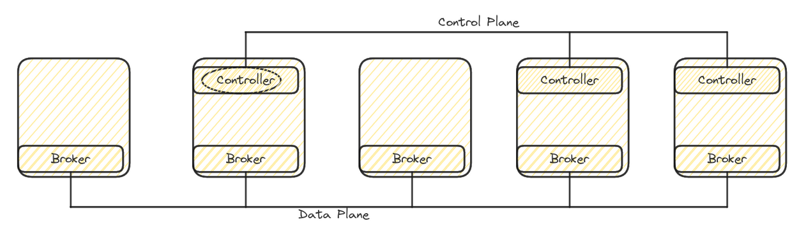

## Kafka introduction and deployments

[Apache Kafka](https://kafka.apache.org) stands as a distributed streaming platform, enabling the seamless reading, writing, storage, and processing of messages across numerous machines.

The [CNCF Strimzi](https://strimzi.io) project encompasses a suite of operators designed to streamline the deployment and management of Kafka clusters within Kubernetes environments.

However, it's crucial to acknowledge that not every scenario warrants the added intricacy Kafka introduces.
It is best suited when handling a high volume of relatively small messages, a task traditional message brokers struggle with, or when faced with near real-time stream processing needs.

Kafka functions on two primary layers capable of independent scaling: the storage layer, efficiently storing messages within a broker cluster, and the compute layer, built atop producer and consumer APIs.
Additionally, it offers two higher-level APIs: the Connect API for seamless integration with external systems and the Streams API tailored for stream processing tasks.

Within a cluster, the control plane manages cluster metadata, while the data plane handles user data.
A broker within the cluster assumes the role of controller, bearing the additional responsibility of overseeing data partition and replica states, along with executing administrative duties like partition reassignment.
In ZooKeeper mode, a singular controller is elected, while the newer KRaft mode operates with a quorum of controllers, ensuring one active controller at any given time with the others ready to take over in the event of a failure.

<p align="center"></p>

Kafka employs a binary communication protocol over TCP (KRPC), delineating APIs into request/response message pairs inclusive of message formats and error codes.
Clients transmit messages mirroring the exact binary format brokers utilize for disk writing.
While the protocol remains both backward and forward compatible, changes in the message format can pose potential issues.
This hasn't happened for a long time, but there is no guarantee.
Typically, every client opens N+1 connections, where N is the number of brokers in the cluster and 1 connection is for metadata updates.
Client requests are processed in the same order they are sent.

Each message is represented as a record featuring a timestamp, key, value, and optional headers.
The key and value are byte arrays, affording flexibility in data encoding via preferred serializers.
While the timestamp is consistently present, its establishment can be either by the application during transmission (default) or by the Kafka runtime upon receipt.
Where possible, records are buffered and dispatched in batches, facilitating efficient processing.

Messages are stored in a topic, which is further divided into one or more partitions, distributed evenly across the brokers.
Each partition is stored on disk as a series of fixed-size commit logs called segments.
Each record within a partition has a unique id called the offset, which is a monotonically increasing number that is never reused.
Message ordering is only guaranteed at the partition level.
If this is a requirement, you can create a single-partition topic or use the same key for sending all related events, so that they always land in the same partition.
Beware that increasing topic partitions may break ordering.

The partition replication protocol lies at the core of Kafka's functionality.
By default, upon the arrival of new record batches, they are initially inscribed into the operating system's page cache before asynchronous disk flushing.
While this mechanism preserves recent messages in the page cache in the event of a Kafka JVM crash, it doesn't safeguard against data loss during machine crashes.
Hence, enabling topic replication is paramount, mitigating data loss by accommodating multiple broker crashes simultaneously.
Additionally, employing a rack-aware Kafka cluster facilitates even distribution of topic replicas across data centers within the same geographic region, further fortifying fault tolerance.

<p align="center"></p>

Within a Kafka cluster, one partition replica is designated as the leader, receiving all producer messages, while the remaining replicas function as followers accessible to consumers.
A topic replication factor of N ensures the system's resilience to N-1 broker failures.
The high watermark (HW) designates the last committed offset of a partition.

When sending messages, a producer configured with acks=all (default) awaits send acknowledgment until all `min.insync.replicas` (minISR) have replicated the messages.
The ISR exclusively includes up-to-date replicas at any given time.
Multiple consumers sharing the same `group.id` form a consumer group, with partitions distributed among them via a partition assignor, facilitating parallelism.
Within a consumer group, each partition is assigned to precisely one consumer to uphold ordering, albeit a consumer may handle multiple partitions.
Periodically or manually, each consumer commits its position (the next offsets to read) to an internal topic named `__consumer_offsets`.

<br/>

---
### Example: deploy a Kafka cluster on localhost

In this example, we deploy a Kafka cluster on localhost.
This is useful for quick tests where a multi node cluster is not required.
We use the latest upstream Kafka release because the downstream release is just a rebuild with few additional and optional plugins.

The `init.sh` script can be used to easily initialize or reset the test environment.
It downloads Kafka to localhost and initializes the Kubernetes cluster installing the Cluster Operator.

```sh
$ source init.sh
Downloading Kafka to /tmp/kafka-test
Done
Configuring Kafka on Kubernetes
namespace/test created
Done

$ $KAFKA_HOME/bin/zookeeper-server-start.sh -daemon $KAFKA_HOME/config/zookeeper.properties \
  && sleep 5 && $KAFKA_HOME/bin/kafka-server-start.sh -daemon $KAFKA_HOME/config/server.properties

$ jcmd | grep kafka
831273 org.apache.zookeeper.server.quorum.QuorumPeerMain /tmp/kafka.yidQitI/config/zookeeper.properties
831635 kafka.Kafka /tmp/kafka.yidQitI/config/server.properties
```

We create a new topic with 3 partitions, then produce and consume some messages.
When consuming messages, you can print additional data such as the partition number.
Every consumer with the same `group.id` is part of the same consumer group.

```sh
$ $KAFKA_HOME/bin/kafka-topics.sh --bootstrap-server :9092 --topic my-topic --create --partitions 3 --replication-factor 1 
Created topic my-topic.

$ $KAFKA_HOME/bin/kafka-topics.sh --bootstrap-server :9092 --topic my-topic --describe
Topic: my-topic	TopicId: a4Lnw1iQSW6MALg0gvxZNQ	PartitionCount: 3	ReplicationFactor: 1	Configs: segment.bytes=1073741824
	Topic: my-topic	Partition: 0	Leader: 0	Replicas: 0	Isr: 0
	Topic: my-topic	Partition: 1	Leader: 0	Replicas: 0	Isr: 0
	Topic: my-topic	Partition: 2	Leader: 0	Replicas: 0	Isr: 0

$ $KAFKA_HOME/bin/kafka-console-producer.sh --bootstrap-server :9092 --topic my-topic --property parse.key=true --property key.separator="#"
>1#hello
>2#world
>^C

$ $KAFKA_HOME/bin/kafka-console-consumer.sh --bootstrap-server :9092 --topic my-topic --group my-group --from-beginning \
  --property print.partition=true --property print.key=true
Partition:0	1	hello
Partition:2	2	world
^CProcessed a total of 2 messages
```

It works, but where these messages are being stored?
The broker property `log.dirs` configures where our topic partitions are stored.
We have 3 partitions, which corresponds to exactly 3 folders on disk.

```sh
$ cat $KAFKA_HOME/config/server.properties | grep log.dirs
log.dirs=/tmp/kafka-logs

$ ls -lh /tmp/kafka-logs/ | grep my-topic
drwxr-xr-x. 2 fvaleri fvaleri  140 Sep  8 16:55 my-topic-0
drwxr-xr-x. 2 fvaleri fvaleri  140 Sep  8 16:55 my-topic-1
drwxr-xr-x. 2 fvaleri fvaleri  140 Sep  8 16:55 my-topic-2
```

The consumer output shows that messages were sent to partition 0 and 2.
Looking inside partition 0, we have a `.log` file containing our records (each segment is named after the initial offset), an `.index` file mapping the record offset to its position in the log and a `.timeindex` file mapping the record timestamp to its position in the log.
The other two files contain additional metadata.

```sh
$ ls -lh /tmp/kafka-logs/my-topic-0/
total 12K
-rw-r--r--. 1 fvaleri fvaleri 10M Sep  8 16:55 00000000000000000000.index
-rw-r--r--. 1 fvaleri fvaleri  74 Sep  8 16:57 00000000000000000000.log
-rw-r--r--. 1 fvaleri fvaleri 10M Sep  8 16:55 00000000000000000000.timeindex
-rw-r--r--. 1 fvaleri fvaleri   8 Sep  8 16:55 leader-epoch-checkpoint
-rw-r--r--. 1 fvaleri fvaleri  43 Sep  8 16:55 partition.metadata
```

Partition log files are in binary format, but Kafka includes a dump tool for decoding them.
On this partition, we have one batch (`baseOffset`), containing only one record (`| offset`) with key "1" and value "hello".

```sh
$ $KAFKA_HOME/bin/kafka-dump-log.sh --deep-iteration --print-data-log --files /tmp/kafka-logs/my-topic-0/00000000000000000000.log
Dumping /tmp/kafka-logs/my-topic-0/00000000000000000000.log
Starting offset: 0
baseOffset: 0 lastOffset: 0 count: 1 baseSequence: 0 lastSequence: 0 producerId: 0 producerEpoch: 0 partitionLeaderEpoch: 0 isTransactional: false isControl: false deleteHorizonMs: OptionalLong.empty position: 0 CreateTime: 1662649069768 size: 74 magic: 2 compresscodec: none crc: 3775885203 isvalid: true
| offset: 0 CreateTime: 1662649069768 keySize: 1 valueSize: 5 sequence: 0 headerKeys: [] key: 1 payload: hello
```

Our consumer group should have committed the offsets to the `__consumer_offsets` internal topic.
The problem is that this topic has 50 partitions by default, so how do we know which partition was used? 
We can use the same algorithm that Kafka uses to map a `group.id` to a specific offset coordinating partition.
The `kafka-cp` function is defined inside the `init.sh` script.

```sh
$ kafka-cp my-group
12
```

We know that the consumer group commit record was sent to `__consumer_offsets-12`, so let's dump this partition too.
Here values are encoded for performance reasons, so we have to pass the `--offsets-decoder` option.

This partition contains other metadata, but we are specifically interested in the `offset_commit` key.
We have a batch from our consumer group, which includes 3 records, one for each input topic partition.
As expected, the consumer group committed offset1 on partition0 and partition2, plus offset0 on partition1 (we sent 2 messages).

```sh
$ $KAFKA_HOME/bin/kafka-dump-log.sh --deep-iteration --print-data-log --offsets-decoder \
  --files /tmp/kafka-logs/__consumer_offsets-12/00000000000000000000.log
Dumping /tmp/kafka-logs/__consumer_offsets-12/00000000000000000000.log
Starting offset: 0
...
baseOffset: 15 lastOffset: 17 count: 3 baseSequence: 0 lastSequence: 2 producerId: -1 producerEpoch: -1 partitionLeaderEpoch: 0 isTransactional: false isControl: false deleteHorizonMs: OptionalLong.empty position: 1716 CreateTime: 1662649581270 size: 232 magic: 2 compresscodec: none crc: 4177101314 isvalid: true
| offset: 15 CreateTime: 1662649581270 keySize: 26 valueSize: 24 sequence: 0 headerKeys: [] key: offset_commit::group=my-group,partition=my-topic-0 payload: offset=1
| offset: 16 CreateTime: 1662649581270 keySize: 26 valueSize: 24 sequence: 1 headerKeys: [] key: offset_commit::group=my-group,partition=my-topic-1 payload: offset=0
| offset: 17 CreateTime: 1662649581270 keySize: 26 valueSize: 24 sequence: 2 headerKeys: [] key: offset_commit::group=my-group,partition=my-topic-2 payload: offset=1
```

<br/>

---
### Example: deploy a Kafka cluster on Kubernetes

In this example, we deploy a Kafka cluster to a Kubernetes cluster using the operator.

**Login first if your Kubernetes cluster requires authentication.**

```sh
$ source init.sh
Reusing Kafka in /tmp/kafka-test
Done
Configuring Kafka on Kubernetes
namespace/test created
Done
```

Then, we create a new Kafka cluster and test topic.
In the YAML files, we can see how the desired cluster state is declared.

In addition to ZooKeeper and Kafka pods, the Entity Operator (EO) pod is also deployed, which includes two namespaced operators: the Topic Operator (TO), which reconciles topic resources, and the User Operator (UO), which reconciles user resources.
If you want to deploy multiple Kafka clusters on the same namespace, make sure to have only one instance of these operators to avoid race conditions.

```sh
$ kubectl create -f sessions/001/resources
kafka.kafka.strimzi.io/my-cluster created
kafkatopic.kafka.strimzi.io/my-topic created

$ kubectl get k,kt,po
NAME                                DESIRED KAFKA REPLICAS   DESIRED ZK REPLICAS   READY   WARNINGS
kafka.kafka.strimzi.io/my-cluster   3                        3                     True    

NAME                                                                                                                           CLUSTER      PARTITIONS   REPLICATION FACTOR   READY
kafkatopic.kafka.strimzi.io/consumer-offsets---84e7a678d08f4bd226872e5cdd4eb527fadc1c6a                                        my-cluster   50           3                    True
kafkatopic.kafka.strimzi.io/my-topic                                                                                           my-cluster   3            3                    True
kafkatopic.kafka.strimzi.io/strimzi-store-topic---effb8e3e057afce1ecf67c3f5d8e4e3ff177fc55                                     my-cluster   1            3                    True
kafkatopic.kafka.strimzi.io/strimzi-topic-operator-kstreams-topic-store-changelog---b75e702040b99be8a9263134de3507fc0cc4017b   my-cluster   1            3                    True

NAME                                          READY   STATUS    RESTARTS   AGE
my-cluster-entity-operator-6d4d7b6fff-d2x7z   3/3     Running   0          83s
my-cluster-kafka-0                            1/1     Running   0          2m45s
my-cluster-kafka-1                            1/1     Running   0          2m45s
my-cluster-kafka-2                            1/1     Running   0          2m45s
my-cluster-zookeeper-0                        1/1     Running   0          4m7s
my-cluster-zookeeper-1                        1/1     Running   0          4m7s
my-cluster-zookeeper-2                        1/1     Running   0          4m7s
strimzi-cluster-operator-7b6bfcc96c-srsdt     1/1     Running   0          8m5s
```

When the Kafka cluster is ready, we produce and consume some messages.
Note that we are using a nice function to avoid repeating that for every client we need.
You can also use the broker pods for that, but it is always risky to spin up another JVM inside a pod, especially in production.

```sh
$ kubectl-kafka bin/kafka-console-producer.sh --bootstrap-server my-cluster-kafka-bootstrap:9092 --topic my-topic
>hello
>world
>^C

$ kubectl-kafka bin/kafka-console-consumer.sh --bootstrap-server my-cluster-kafka-bootstrap:9092 \
  --topic my-topic --group my-group --from-beginning --max-messages 2
world
hello
^CProcessed a total of 2 messages
```

When debugging issues, you usually need to retrieve various artifacts from the environment, which can be a lot of effort.
Fortunately, Strimzi maintains a backward compatible must-gather script that can be used to download all relevant artifacts and logs from a specific Kafka cluster.
Add the `--secrets=all` option to also get secret values.

```sh
$ curl -s https://raw.githubusercontent.com/strimzi/strimzi-kafka-operator/main/tools/report.sh \
  | bash -s -- --namespace=test --cluster=my-cluster --out-dir=~/Downloads
deployments
    deployment.apps/my-cluster-entity-operator
statefulsets
replicasets
    replicaset.apps/my-cluster-entity-operator-7d576599c5
configmaps
    configmap/my-cluster-entity-topic-operator-config
    configmap/my-cluster-entity-user-operator-config
    configmap/my-cluster-kafka-0
    configmap/my-cluster-kafka-1
    configmap/my-cluster-kafka-2
    configmap/my-cluster-zookeeper-config
secrets
    secret/my-cluster-clients-ca
    secret/my-cluster-clients-ca-cert
    secret/my-cluster-cluster-ca
    secret/my-cluster-cluster-ca-cert
    secret/my-cluster-cluster-operator-certs
    secret/my-cluster-entity-topic-operator-certs
    secret/my-cluster-entity-user-operator-certs
    secret/my-cluster-kafka-brokers
    secret/my-cluster-zookeeper-nodes
services
    service/my-cluster-kafka-bootstrap
    service/my-cluster-kafka-brokers
    service/my-cluster-zookeeper-client
    service/my-cluster-zookeeper-nodes
poddisruptionbudgets
    poddisruptionbudget.policy/my-cluster-kafka
    poddisruptionbudget.policy/my-cluster-zookeeper
roles
    role.rbac.authorization.k8s.io/my-cluster-entity-operator
rolebindings
    rolebinding.rbac.authorization.k8s.io/my-cluster-entity-topic-operator-role
    rolebinding.rbac.authorization.k8s.io/my-cluster-entity-user-operator-role
networkpolicies
    networkpolicy.networking.k8s.io/my-cluster-entity-operator
    networkpolicy.networking.k8s.io/my-cluster-network-policy-kafka
    networkpolicy.networking.k8s.io/my-cluster-network-policy-zookeeper
pods
    pod/my-cluster-entity-operator-7d576599c5-9q22j
    pod/my-cluster-kafka-0
    pod/my-cluster-kafka-1
    pod/my-cluster-kafka-2
    pod/my-cluster-zookeeper-0
    pod/my-cluster-zookeeper-1
    pod/my-cluster-zookeeper-2
persistentvolumeclaims
    persistentvolumeclaim/data-my-cluster-kafka-0
    persistentvolumeclaim/data-my-cluster-kafka-1
    persistentvolumeclaim/data-my-cluster-kafka-2
    persistentvolumeclaim/data-my-cluster-zookeeper-0
    persistentvolumeclaim/data-my-cluster-zookeeper-1
    persistentvolumeclaim/data-my-cluster-zookeeper-2
ingresses
routes
clusterroles
    clusterrole.rbac.authorization.k8s.io/strimzi-cluster-operator-global
    clusterrole.rbac.authorization.k8s.io/strimzi-cluster-operator-leader-election
    clusterrole.rbac.authorization.k8s.io/strimzi-cluster-operator-namespaced
    clusterrole.rbac.authorization.k8s.io/strimzi-cluster-operator-watched
    clusterrole.rbac.authorization.k8s.io/strimzi-entity-operator
    clusterrole.rbac.authorization.k8s.io/strimzi-kafka-broker
    clusterrole.rbac.authorization.k8s.io/strimzi-kafka-client
clusterrolebindings
    clusterrolebinding.rbac.authorization.k8s.io/strimzi-cluster-operator
    clusterrolebinding.rbac.authorization.k8s.io/strimzi-cluster-operator-kafka-broker-delegation
    clusterrolebinding.rbac.authorization.k8s.io/strimzi-cluster-operator-kafka-client-delegation
clusteroperator
    deployment.apps/strimzi-cluster-operator
    replicaset.apps/strimzi-cluster-operator-85b9b646cc
replicaset.apps/strimzi-cluster-operator-86948f6756
    pod/strimzi-cluster-operator-85b9b646cc-dvjfh
    configmap/strimzi-cluster-operator
draincleaner
customresources
    kafkas.kafka.strimzi.io
        my-cluster
    kafkatopics.kafka.strimzi.io
        consumer-offsets---84e7a678d08f4bd226872e5cdd4eb527fadc1c6a
        my-topic
        strimzi-store-topic---effb8e3e057afce1ecf67c3f5d8e4e3ff177fc55
        strimzi-topic-operator-kstreams-topic-store-changelog---b75e702040b99be8a9263134de3507fc0cc4017b
    strimzipodsets.core.strimzi.io
        my-cluster-kafka
        my-cluster-zookeeper
events
logs
    my-cluster-kafka-0
    my-cluster-kafka-1
    my-cluster-kafka-2
    my-cluster-zookeeper-0
    my-cluster-zookeeper-1
    my-cluster-zookeeper-2
    my-cluster-entity-operator-7d576599c5-9q22j
Report file report-21-02-2024_15-11-18.zip created
```
