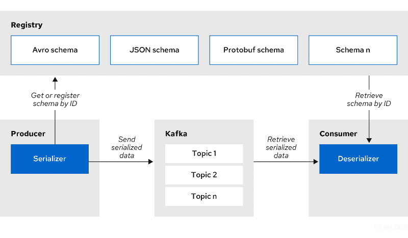

## Schema registry and why it is useful

It is pretty obvious why schemas are useful for multiple clients collaborating on the same data because they provide shared metadata, including field availability and types.
Additionally, data storage and processing are more efficient as schemas do not need to be sent with each message and numbers can be stored in binary form.

It is less obvious why we may need a central schema registry.
Why would you want to add this complexity to your architecture?
Why not simply agree on a message schema, put it in shared library and live with that?
Distributing schemas is straightforward when dealing with a limited number of in-house clients, but becomes complex when managing a large number of clients, including third-party ones.
In addition to distribution, we also need to evolve these schema safely in a backwards and forwards compatible way, to allow new clients to read old data and old clients to read new data.

[Red Hat Service Registry](https://catalog.redhat.com/software/operators/detail/5ef2818e7dc79430ca5f4fd2) is based on [Apicurio Registry](https://www.apicur.io/registry), which is a schema registry for REST APIs (OpenAPI) and message schemas (AsyncAPI).
It supports pluggable storage (in-memory, Kafka, PostgreSQL), schema versioning, schema validation, and provides Java serializers/deserializers (SerDes) for Avro, Protobuf and JSON Schema formats.
It also provides a Maven plugin that we can use to register schema artifacts at build time, a REST API, and a web console to do CRUD operations on schema artifacts.
When migrating from Confluent registry, it is possible to enable the API translation layer and use a tool called `exportConfluent` to import existing schemas.



A registered schema artifact is uniquely identified by the tuple `(groupId, artifactId, version)`.
Both `groupId` and `artifactId` are generated by the client, while `globalId` and `contentId` are generated by the server.
The `globalId` is the unique id of an artifact version, while the `contentId` is the unique id of the artifact content.

The serializer exchanges the `artifactId` for a `globalId`, which is then added as record header or as payload prefix, depending on the producer configuration.
The default `artifactId` resolver strategy is the `TopicIdStrategy`, which looks for schema artifacts with the same `artifactId` as the Kafka topic, plus `-key` or `-value` suffixes.
You might want to use the `RecordIdStrategy` strategy if you have different Kafka topics with the same Avro message type.
When you scale up your application instances, there is a race condition if you register the schema at startup.
In that case, you may end up with multiple schemas with different `globalId`, but the same `contentId`.
The solution is to register the schema at build time using the Maven plugin.

The deserializer fetches the right schema version using the `globalId`, but you can also configure it to fetch by `contentId` (Confluent default).
Setting the `apicurio.registry.check-period-ms` client property, we can determine the time after which a cached artifact is auto-evicted and needs to be fetched again on the next record.

<br>

---
### Example: schema registry in action

First, we [deploy the Strimzi Cluster Operator and Kafka cluster](/sessions/001), and set the external listener.
Then, we deploy the Service Registry instance with the in-memory storage system.

```sh
$ kubectl patch k my-cluster --type merge -p '
  spec:
    kafka:
      listeners:
        - name: external
          port: 9094
          type: route
          tls: true'
kafka.kafka.strimzi.io/my-cluster patched

$ for f in sessions/003/resources/*.yaml; do sed "s/namespace: .*/namespace: $INIT_NAMESPACE/g" $f \
  | kubectl create -f - --dry-run=client -o yaml | kubectl replace --force -f -; done
clusterrole.rbac.authorization.k8s.io "apicurioregistry-editor-role" deleted
clusterrole.rbac.authorization.k8s.io "apicurioregistry-viewer-role" deleted
clusterrole.rbac.authorization.k8s.io "apicurio-registry-operator-role" deleted
clusterrolebinding.rbac.authorization.k8s.io "apicurio-registry-operator-rolebinding" deleted
serviceaccount/apicurio-registry-operator replaced
clusterrole.rbac.authorization.k8s.io/apicurioregistry-editor-role replaced
clusterrole.rbac.authorization.k8s.io/apicurioregistry-viewer-role replaced
clusterrole.rbac.authorization.k8s.io/apicurio-registry-operator-role replaced
role.rbac.authorization.k8s.io/apicurio-registry-operator-leader-election-role replaced
clusterrolebinding.rbac.authorization.k8s.io/apicurio-registry-operator-rolebinding replaced
rolebinding.rbac.authorization.k8s.io/apicurio-registry-operator-leader-election-rolebinding replaced
deployment.apps/apicurio-registry-operator replaced
apicurioregistry.registry.apicur.io/my-registry replaced

$ kubectl get po
NAME                                          READY   STATUS    RESTARTS   AGE
apicurio-registry-operator-767ff9ffff-bq5l8   1/1     Running   0          5m31s
my-cluster-entity-operator-6d4d7b6fff-d2x7z   3/3     Running   0          83s
my-cluster-kafka-0                            1/1     Running   0          2m45s
my-cluster-kafka-1                            1/1     Running   0          2m45s
my-cluster-kafka-2                            1/1     Running   0          2m45s
my-cluster-zookeeper-0                        1/1     Running   0          4m7s
my-cluster-zookeeper-1                        1/1     Running   0          4m7s
my-cluster-zookeeper-2                        1/1     Running   0          4m7s
my-registry-deployment-6fd6645b7d-k9v26       1/1     Running   0          5m22s
strimzi-cluster-operator-7b6bfcc96c-srsdt     1/1     Running   0          8m5s
```

Now, we just need to tell our client application where it can find the Kafka cluster by setting the bootstrap URL and the schema registry REST endpoint.
We also need to provide the truststore location and password because we are connecting externally.

```sh
$ kubectl get secret my-cluster-cluster-ca-cert -o jsonpath="{.data['ca\.p12']}" | base64 -d > /tmp/truststore.p12 \
  && export BOOTSTRAP_SERVERS=$(kubectl get routes my-cluster-kafka-bootstrap -o jsonpath="{.status.ingress[0].host}"):443 \
  REGISTRY_URL=http://$(kubectl get apicurioregistries my-registry -o jsonpath="{.status.info.host}")/apis/registry/v2 \
  TOPIC_NAME="my-topic" ARTIFACT_GROUP="default" SSL_TRUSTSTORE_LOCATION="/tmp/truststore.p12" \
  SSL_TRUSTSTORE_PASSWORD=$(kubectl get secret my-cluster-cluster-ca-cert -o jsonpath="{.data['ca\.password']}" | base64 -d)

$ mvn clean compile exec:java -f sessions/003/kafka-avro/pom.xml -q
Producing records
Records produced
Consuming all records
Record: Hello-1663594981476
Record: Hello-1663594982041
Record: Hello-1663594982041
Record: Hello-1663594982041
Record: Hello-1663594982042
```

[Look at the code](/sessions/003/kafka-avro/src/main/java/it/fvaleri/example/Main.java) to see how the schema is registered and used.
The registration happens at build time and the Maven plugin executes the following API request for every configured schema artifact.
Note that we are using the "default" group id, but you can specify a custom name.

```sh
$ curl -s -X POST -H "Content-Type: application/json" \
  -H "X-Registry-ArtifactId: my-topic-value" -H "X-Registry-ArtifactType: AVRO" \
  -d @sessions/003/kafka-avro/src/main/resources/greeting.avsc \
  "$REGISTRY_URL/groups/default/artifacts?ifExists=RETURN_OR_UPDATE" | jq
{
  "name": "Greeting",
  "createdBy": "",
  "createdOn": "2022-09-30T06:31:36+0000",
  "modifiedBy": "",
  "modifiedOn": "2022-09-30T06:31:36+0000",
  "id": "my-topic-value",
  "version": "1",
  "type": "AVRO",
  "globalId": 4,
  "state": "ENABLED",
  "contentId": 6
}
```

Finally, we use the REST API to confirm that our schema was registered correctly.
We can also look at the schema content and metadata, which may be useful for debugging.

```sh
$ curl -s "$REGISTRY_URL/search/artifacts" | jq
{
  "artifacts": [
    {
      "id": "my-topic-value",
      "name": "Greeting",
      "createdOn": "2022-09-19T13:42:59+0000",
      "createdBy": "",
      "type": "AVRO",
      "state": "ENABLED",
      "modifiedOn": "2022-09-19T13:42:59+0000",
      "modifiedBy": ""
    }
  ],
  "count": 1
}

$ curl -s "$REGISTRY_URL/groups/default/artifacts/my-topic-value" | jq
{
  "type": "record",
  "name": "Greeting",
  "fields": [
    {
      "name": "Message",
      "type": "string"
    },
    {
      "name": "Time",
      "type": "long"
    }
  ]
}

$ curl -s "$REGISTRY_URL/groups/default/artifacts/my-topic-value/meta" | jq
{
  "name": "Greeting",
  "createdBy": "",
  "createdOn": "2022-09-19T13:42:59+0000",
  "modifiedBy": "",
  "modifiedOn": "2022-09-19T13:42:59+0000",
  "id": "my-topic-value",
  "version": "1",
  "type": "AVRO",
  "globalId": 1,
  "state": "ENABLED",
  "contentId": 1
}
```
