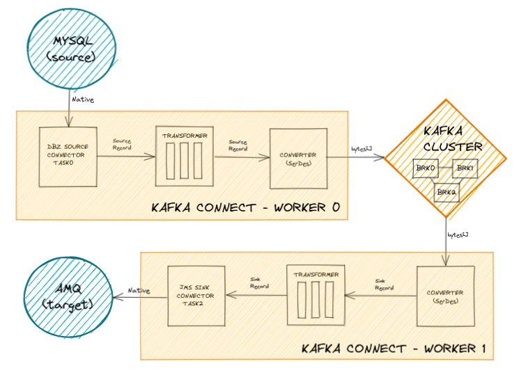

## Data integration and Kafka Connect

Kafka Connect stands as a versatile, fault-tolerant integration platform, driven by configurations and based in Kafka client APIs.
Operating either in standalone or distributed mode, forming a cluster of workers, it extends its functionality through connector, converter, and transformation plugins, adhering to the Connect API interfaces.
These plugins can be seamlessly incorporated using the `plugin.path property`, ensuring a degree of isolation.

Connectors within Kafka Connect come in two distinct forms:

- Source connectors: Responsible for importing data from external systems into Kafka.
- Sink connectors: Dedicated to exporting data from Kafka to external systems.

While only a handful of connectors are officially part of the Kafka ecosystem, a plethora of others can be found on platforms like GitHub or public registries such as the Confluent Hub.

Converters play a pivotal role in serializing and deserializing data during communication with the Kafka cluster.
For lightweight transformations such as filtering, mapping, or replacing, the Single Message Transformations can be applied at the record level.
However, for complex transformations such as aggregations, joins, or external service calls, leveraging a stream processing library like Kafka Streams is recommended.

<p align="center"></p>

Each connector job is divided into a series of single-threaded tasks, executed on worker nodes.
The maximum number of tasks can be configured using the `maxTasks` property at the connector configuration level, although the actual number tasks depends on the specific connector and, for sink connectors, on how many input partitions.

Task rebalancing occurs in the event of worker failures, addition of new connectors, or configuration changes, but not when individual tasks fail.
Configurations and other metadata are stored within internal topics, ensuring easy recovery in the event of worker crashes.

Key internal topics include:

- `offset.storage.topic`: Compacted topic where source connector offsets are stored.
  Sink connectors store the offsets inside `__consumer_offsets` like normal consumer groups.
- `config.storage.topic`: Compacted topic where connector configurations are stored.
- `status.storage.topic`: Compacted topic where connector and task states are stored.

The Change Data Capture (CDC) pattern describes a system that captures and emits data changes, enabling other applications to react to these events.
[Debezium](https://debezium.io), a CDC engine, thrives when deployed atop Kafka Connect.
It encompasses a suite of source connectors, facilitating the creation of data pipelines bridging traditional data stores with Kafka.

Debezium generates change events by executing an initial snapshot and subsequently reading the internal transaction log from the snapshot's point onward.
Incremental snapshots can also be configured.
However, employing Debezium necessitates specific configurations for each connector to enable access to the transaction log.

Despite this drawback, Debezium offers numerous advantages over poll-based connectors or applications:

- Low overhead: Near real-time reaction to data changes avoids increased CPU load from frequent polling.
- No lost changes: Unlike poll loops, which may overlook intermediary changes between runs (e.g., updates, deletes).
- No data model impact: Eliminates the need for timestamp columns to determine the last data update.

Debezium's change events are self-contained, with each message encompassing the JSON schema, ensuring consumption even as the data source schema evolves over time.
In case of Kafka or external system failure, the Debezium connector seamlessly reconnects and resumes operation upon restoration.
However, if the connector remains inactive for an extended period, resulting in transaction log purging, it loses its position, necessitating another initial snapshot.
By default, Debezium provides at-least-once semantics, potentially leading to duplicate events in failure scenarios.
Yet, the change event incorporates elements for identifying and filtering out duplicates.

<br/>

---
### Example: cloud-native CDC pipeline

First, [deploy the Strimzi Cluster Operator and Kafka cluster](/sessions/001).
When the cluster is ready, we deploy a MySQL instance (the external system) and Kafka Connect cluster.

Note that we are also initializing the database.
The Kafka Connect image uses an internal component (Kaniko) to build a custom image containing the configured MySQL connector.
That said, you can also build and use your own Connect image derived from Strimzi one.

```sh
$ kubectl create -f sessions/004/resources \
  && kubectl wait --for=condition=Ready pod -l app=my-mysql --timeout=300s \
  && kubectl exec my-mysql-0 -- sh -c 'mysql -u root < /tmp/sql/initdb.sql'
persistentvolumeclaim/my-mysql-data created
configmap/my-mysql-cfg created
configmap/my-mysql-env created
configmap/my-mysql-init created
statefulset.apps/my-mysql created
service/my-mysql-svc created
kafkaconnect.kafka.strimzi.io/my-connect-cluster created
kafkaconnector.kafka.strimzi.io/mysql-source-connector created
pod/my-mysql-0 condition met

$ kubectl get po,kt
NAME                                              READY   STATUS      RESTARTS   AGE
pod/my-cluster-entity-operator-6b68959588-8mccx   3/3     Running     0          30m
pod/my-cluster-kafka-0                            1/1     Running     0          32m
pod/my-cluster-kafka-1                            1/1     Running     0          32m
pod/my-cluster-kafka-2                            1/1     Running     0          32m
pod/my-cluster-zookeeper-0                        1/1     Running     0          34m
pod/my-cluster-zookeeper-1                        1/1     Running     0          34m
pod/my-cluster-zookeeper-2                        1/1     Running     0          34m
pod/my-connect-cluster-connect-0                  1/1     Running     0          10m
pod/my-connect-cluster-connect-build-1-build      0/1     Completed   0          11m
pod/my-mysql-0                                    1/1     Running     0          11m

NAME                                                                                                                           CLUSTER      PARTITIONS   REPLICATION FACTOR   READY
kafkatopic.kafka.strimzi.io/connect-cluster-configs                                                                            my-cluster   1            3                    True
kafkatopic.kafka.strimzi.io/connect-cluster-offsets                                                                            my-cluster   25           3                    True
kafkatopic.kafka.strimzi.io/connect-cluster-status                                                                             my-cluster   5            3                    True
kafkatopic.kafka.strimzi.io/consumer-offsets---84e7a678d08f4bd226872e5cdd4eb527fadc1c6a                                        my-cluster   50           3                    True
kafkatopic.kafka.strimzi.io/debezium-heartbeat.my-mysql---76187ecaffdb5bfe72afa38b976011f2e16fa30b                             my-cluster   3            3                    True
kafkatopic.kafka.strimzi.io/my-mysql                                                                                           my-cluster   3            3                    True
kafkatopic.kafka.strimzi.io/my-topic                                                                                           my-cluster   3            3                    True
kafkatopic.kafka.strimzi.io/strimzi-store-topic---effb8e3e057afce1ecf67c3f5d8e4e3ff177fc55                                     my-cluster   1            3                    True
kafkatopic.kafka.strimzi.io/strimzi-topic-operator-kstreams-topic-store-changelog---b75e702040b99be8a9263134de3507fc0cc4017b   my-cluster   1            3                    True
kafkatopic.kafka.strimzi.io/testdb.history                                                                                     my-cluster   1            3                    True
```

As you may have guessed at this point, we are going to emit MySQL row changes and import them into Kafka, so that other applications can pick them up and process them.
Let's check if the connector and its tasks are running fine by using the `KafkaConnector` resource, which is easier than interacting via REST requests.

```sh
$ kubectl get kctr mysql-source-connector -o yaml | yq .status
conditions:
  - lastTransitionTime: "2022-09-15T07:56:48.585862Z"
    status: "True"
    type: Ready
connectorStatus:
  connector:
    state: RUNNING
    worker_id: 10.128.2.29:8083
  name: mysql-source-connector
  tasks:
    - id: 0
      state: RUNNING
      worker_id: 10.128.2.29:8083
  type: source
observedGeneration: 1
tasksMax: 1
topics:
  - __debezium-heartbeat.my-mysql
  - my-mysql
```

Debezium configuration is specific to each connector and it is documented in detail.
The value of `server_id` must be unique for each server and replication client in the MySQL cluster.
In this case, the MySQL user must have appropriate permissions on all databases for which the connector captures changes.

```sh
$ kubectl get cm my-mysql-cfg -o yaml | yq .data
my.cnf: |
  !include /etc/my.cnf
  [mysqld]
  server_id = 111111  
  log_bin = mysql-bin
  binlog_format = ROW
  binlog_row_image = FULL
  binlog_rows_query_log_events = ON
  expire_logs_days = 10
  gtid_mode = ON
  enforce_gtid_consistency = ON

$ kubectl get cm my-mysql-init -o yaml | yq .data
initdb.sql: |
  use testdb;
    CREATE TABLE IF NOT EXISTS customers (
    id INTEGER NOT NULL AUTO_INCREMENT PRIMARY KEY,
    first_name VARCHAR(255) NOT NULL,
    last_name VARCHAR(255) NOT NULL,
    email VARCHAR(255) NOT NULL UNIQUE
  );

  CREATE USER IF NOT EXISTS 'debezium'@'%' IDENTIFIED WITH caching_sha2_password BY 'changeit';
  GRANT SELECT, RELOAD, SHOW DATABASES, REPLICATION SLAVE, REPLICATION CLIENT ON *.* TO 'debezium'@'%';
  FLUSH PRIVILEGES;
```

Enough with describing the configuration, now let's create some changes using good old SQL.

```sh
$ kubectl exec my-mysql-0 -- sh -c 'MYSQL_PWD="changeit" mysql -u admin testdb -e "
  INSERT INTO customers (first_name, last_name, email) VALUES (\"John\", \"Doe\", \"jdoe@example.com\");
  UPDATE customers SET first_name = \"Jane\" WHERE id = 1;
  INSERT INTO customers (first_name, last_name, email) VALUES (\"Dylan\", \"Dog\", \"ddog@example.com\");
  SELECT * FROM customers;"'
id	first_name	last_name	email
1	Jane	Doe	jdoe@example.com
2	Dylan	Dog	ddog@example.com
```

The MySQL connector writes change events that occur in a table to a Kafka topic named like `serverName.databaseName.tableName`.
We created 3 changes (insert-update-insert), so we have 3 records in that topic.
It's interesting to look at some record properties: `op` is the change type (c=create, r=read for snapshot only, u=update, d=delete), `gtid` is the global transaction identifier that is unique in a MySQL cluster, `payload.source.ts_ms` is the timestamp when the change was applied, `payload.ts_ms` is the timestamp when Debezium processed that event. The notification lag is the difference with the source timestamp.

```sh
$ kubectl-kafka bin/kafka-console-consumer.sh --bootstrap-server my-cluster-kafka-bootstrap:9092 \
  --topic my-mysql.testdb.customers --from-beginning --timeout-ms 5000
Struct{after=Struct{id=2,first_name=Dylan,last_name=Dog,email=ddog@example.com},source=Struct{version=1.9.5.Final-redhat-00001,connector=mysql,name=my-mysql,ts_ms=1663228576000,db=testdb,table=customers,server_id=224466,gtid=1c90a695-34cb-11ed-aba8-0a580a810216:16,file=mysql-bin.000002,pos=2585,row=0,thread=67},op=c,ts_ms=1663228576092}
Struct{after=Struct{id=1,first_name=John,last_name=Doe,email=jdoe@example.com},source=Struct{version=1.9.5.Final-redhat-00001,connector=mysql,name=my-mysql,ts_ms=1663228576000,db=testdb,table=customers,server_id=224466,gtid=1c90a695-34cb-11ed-aba8-0a580a810216:14,file=mysql-bin.000002,pos=1690,row=0,thread=67},op=c,ts_ms=1663228576088}
Struct{before=Struct{id=1,first_name=John,last_name=Doe,email=jdoe@example.com},after=Struct{id=1,first_name=Jane,last_name=Doe,email=jdoe@example.com},source=Struct{version=1.9.5.Final-redhat-00001,connector=mysql,name=my-mysql,ts_ms=1663228576000,db=testdb,table=customers,server_id=224466,gtid=1c90a695-34cb-11ed-aba8-0a580a810216:15,file=mysql-bin.000002,pos=2103,row=0,thread=67},op=u,ts_ms=1663228576091}
org.apache.kafka.common.errors.TimeoutException
Processed a total of 3 messages
```

As an additional exercise, you can extend this data pipeline by configuring a sink connector and exporting these changes to an external system like Artemis Broker.
