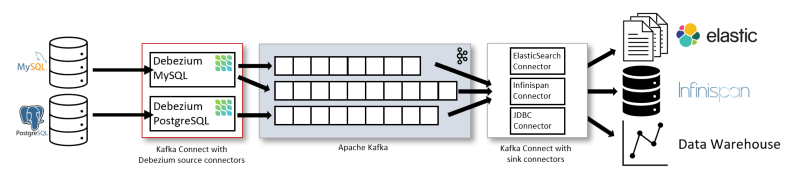

## Kafka Connect and change data capture

Kafka Connect is a **configuration-driven fault-tolerant integration platform** based on the Kafka client APIs, which
runs in standalone or distributed mode (cluster of workers). The platform can be extended by using connectors,
converters and transformations plugins which implements the connect API interfaces. The recommended way to add them is
by using the `plugin.path` property, which provides some level of isolation. When running in distributed mode,
configurations and other metadata are stored in internal topics on the target Kafka cluster to provide HA.

There are two kinds of connectors: **source connector** for importing data from an external system to Kafka and **sink
connector** for exporting data from Kafka to an external system. Only few connectors are officially part of Kafka, but
there are many available on GitHub or on public registries like Confluent Hub.

Each connector job is split into a number of **single thread tasks** which run on worker nodes. You can configure the
max number of tasks that can be created by setting the `maxTasks` at the connector configuration level, but the actual
number of tasks depends on the specific connector and, for sink connectors, on how many partitions we have. Tasks
rebalancing uses the same rebalancing protocol of consumer groups and happens when a worker fails, a new connector is
added or there is a configuration change, but not when a task fails.

The **converters** are used by connectors to serialize and deserialize data when talking to the Kafka cluster, while
**transformations**, also called single message transformations (SMTs), can be optionally used to apply simple changes
at the record level. When you need to do heavy transformations (e.g. join streams, call external services), you should
use a stream processing library such as Kafka Streams.

The **change data capture** (CDC) pattern describe a system that captures and emit all data changes, so that other
applications can respond to those events. [Debezium](https://debezium.io) is a CDC engine that run standalone, but works
best when deployed on top of Kafka Connect. Debezium is actually a collection of source connectors that can be used to
create data pipelines that bridge traditional data stores with Kafka. The connector produces change events by performing
an initial consistent snapshot and then reads the internal transaction log from the point at which the snapshot was
made. It is also possible to perform incremental snapshots.



The disadvantage of using Debezium is that every connector requires specific configurations to enable transaction log
access. Instead, the advantages over a poll-based connector or application are:

- **Low overhead**: near real-time reaction to data changes avoids increased CPU load due to frequent polling.
- **No lost changes**: using a poll loop you may miss intermediary changes between two runs (updates, deletes).
- **No data model impact**: no need for timestamp columns to determine the last update of data.

Debezium Change events are self contained because they include the JSON Schema, so that you can always consume them even
if the data source schema changes over time. By default, Debezium provides at-least-once semantics, which means
duplicates can arise in failure scenarios. If the source data store or Kafka fail, the connector will reconnect and
resume once they are restored. If the connector stops for too long and the transaction log is purged, then the connector
lose its position and performs another initial snapshot. If one of the Kafka Connect workers crashes, the task will be
restarted in another worker and duplicates can arise. The change event contains elements that allows you to identify and
filter out duplicates (idempotency is always a good idea in distributed systems).

### Example: cloud-native CDC pipeline

[Deploy Streams operator and Kafka cluster](/sessions/001). When the cluster is ready, we can deploy MySQL and Kafka
Connect with Debezium MySQL connector. The Kafka Connect image use an internal component (kaniko) to build a custom
image containing the configured connectors. This component requires credentials for pushing to an external image
registry, so we first need to create a secret for that (tip: you can use a quay.io robot account instead of your user
account). Note that we are also initializing the database.

```sh
$ kubectl create secret docker-registry registry-authn \
  --docker-server="quay.io" --docker-username="fvaleri+k8s" --docker-password="***" \
  --dry-run=client -o yaml | kubectl replace --force -f -
secret/registry-authn replaced

$ sed "s,#VALUE0#,quay.io/fvaleri/my-connect:2.1,g" sessions/004/crs/* | kubectl create -f - \
  && kubectl wait --for="condition=Ready" pod -l app=mysql --timeout=300s \
  && kubectl exec my-mysql-ss-0 -- bash -c 'mysql -u root < /tmp/sql/initdb.sql'
configmap/my-mysql-init created
persistentvolumeclaim/my-mysql-data created
configmap/my-mysql-config created
configmap/my-mysql-env created
statefulset.apps/my-mysql-ss created
service/my-mysql-svc created
kafkaconnect.kafka.strimzi.io/my-connect created
secret/connectors created
kafkaconnector.kafka.strimzi.io/mysql-source created
pod/my-mysql-ss-0 condition met

$ kubectl get po,kt
NAME                                              READY   STATUS      RESTARTS   AGE
pod/my-cluster-entity-operator-6b68959588-8mccx   3/3     Running     0          30m
pod/my-cluster-kafka-0                            1/1     Running     0          32m
pod/my-cluster-kafka-1                            1/1     Running     0          32m
pod/my-cluster-kafka-2                            1/1     Running     0          32m
pod/my-cluster-zookeeper-0                        1/1     Running     0          34m
pod/my-cluster-zookeeper-1                        1/1     Running     0          34m
pod/my-cluster-zookeeper-2                        1/1     Running     0          34m
pod/my-connect-connect-95d5c7478-2vkwt            1/1     Running     0          10m
pod/my-connect-connect-build-1-build              0/1     Completed   0          11m
pod/my-mysql-ss-0                                 1/1     Running     0          11m

NAME                                                                                                                           CLUSTER      PARTITIONS   REPLICATION FACTOR   READY
kafkatopic.kafka.strimzi.io/connect-cluster-configs                                                                            my-cluster   1            3                    True
kafkatopic.kafka.strimzi.io/connect-cluster-offsets                                                                            my-cluster   25           3                    True
kafkatopic.kafka.strimzi.io/connect-cluster-status                                                                             my-cluster   5            3                    True
kafkatopic.kafka.strimzi.io/consumer-offsets---84e7a678d08f4bd226872e5cdd4eb527fadc1c6a                                        my-cluster   50           3                    True
kafkatopic.kafka.strimzi.io/debezium-heartbeat.my-mysql---76187ecaffdb5bfe72afa38b976011f2e16fa30b                             my-cluster   3            3                    True
kafkatopic.kafka.strimzi.io/my-mysql                                                                                           my-cluster   3            3                    True
kafkatopic.kafka.strimzi.io/my-topic                                                                                           my-cluster   3            3                    True
kafkatopic.kafka.strimzi.io/strimzi-store-topic---effb8e3e057afce1ecf67c3f5d8e4e3ff177fc55                                     my-cluster   1            3                    True
kafkatopic.kafka.strimzi.io/strimzi-topic-operator-kstreams-topic-store-changelog---b75e702040b99be8a9263134de3507fc0cc4017b   my-cluster   1            3                    True
kafkatopic.kafka.strimzi.io/testdb.history                                                                                     my-cluster   1            3                    True
```

As you may have guessed at this point, we are going to emit MySQL row changes and import them into Kafka, so that other
applications can pick them up and process. Let's check if the connector and its tasks are running fine by using
the `KafkaConnector` resource, which is easier than interacting via REST requests.

```sh
$ kubectl get kctr mysql-source -o yaml | yq e '.status'
conditions:
  - lastTransitionTime: "2022-09-15T07:56:48.585862Z"
    status: "True"
    type: Ready
connectorStatus:
  connector:
    state: RUNNING
    worker_id: 10.128.2.23:8083
  name: mysql-source
  tasks:
    - id: 0
      state: RUNNING
      worker_id: 10.128.2.23:8083
  type: source
observedGeneration: 1
tasksMax: 1
topics:
  - my-mysql
  - my-mysql.testdb.customers
```

Debezium configuration is specific to each connector and it is documented in details. In this case, MySQL user must have
appropriate permissions on all databases for which the connector captures changes. The value for the `server_id` must be
unique for each server and replication client in MySQL cluster. Also note that we are externalizing some connector
configurations, specifically username and password.

```sh
$ kubectl get cm my-mysql-init -o yaml | yq e '.data'
initdb.sql: |
  use testdb;
    CREATE TABLE customers (
    id INTEGER NOT NULL AUTO_INCREMENT PRIMARY KEY,
    first_name VARCHAR(255) NOT NULL,
    last_name VARCHAR(255) NOT NULL,
    email VARCHAR(255) NOT NULL UNIQUE
  );

  CREATE USER IF NOT EXISTS 'debezium'@'%' IDENTIFIED WITH caching_sha2_password BY 'changeit';
  GRANT SELECT, RELOAD, SHOW DATABASES, REPLICATION SLAVE, REPLICATION CLIENT ON *.* TO 'debezium'@'%';
  FLUSH PRIVILEGES;

$ kubectl get cm my-mysql-config -o yaml | yq e '.data'
my.cnf: |
  !include /etc/my.cnf
  [mysqld]
  server_id = 224466
  log_bin = mysql-bin
  binlog_format = ROW
  binlog_row_image = FULL
  binlog_rows_query_log_events = ON
  expire_logs_days = 10
  gtid_mode = ON
  enforce_gtid_consistency = ON

$ kubectl get kc my-connect -o yaml | yq e '.spec.build.plugins'
- artifacts:
    - type: zip
      url: https://maven.repository.redhat.com/ga/io/debezium/debezium-connector-mysql/1.9.5.Final-redhat-00001/debezium-connector-mysql-1.9.5.Final-redhat-00001-plugin.zip
  name: debezium-mysql

$ kubectl get kctr source-mysql -o yaml
apiVersion: kafka.strimzi.io/v1beta2
kind: KafkaConnector
metadata:
  creationTimestamp: "2022-09-14T12:28:43Z"
  generation: 1
  labels:
    strimzi.io/cluster: my-connect
  name: source-mysql
  namespace: test
  resourceVersion: "1213875"
  uid: 805e62dc-ad0f-47dd-b5c3-6c53fea46d20
spec:
  class: io.debezium.connector.mysql.MySqlConnector
  config:
    database.allowPublicKeyRetrieval: true
    database.dbname: testdb
    database.history.kafka.bootstrap.servers: my-cluster-kafka-bootstrap:9092
    database.history.kafka.topic: testdb.history
    database.hostname: my-mysql-svc
    database.include.list: testdb
    database.password: ${file:/opt/kafka/external-configuration/connectors/config.properties:mysql.password}
    database.port: 3306
    database.server.id: "224466"
    database.server.name: my-mysql
    database.user: ${file:/opt/kafka/external-configuration/connectors/config.properties:mysql.username}
    table.include.list: testdb.customers
  tasksMax: 1
  
$ kubectl get secret connectors -o yaml | yq e '.data."config.properties"' | base64 -d
mysql.username=debezium
mysql.password=changeit
```

Enough with describing the configuration, now let's create some changes using the good old SQL.

```sh
$ kubectl exec my-mysql-ss-0 -- sh -c 'MYSQL_PWD="changeit" mysql -u admin testdb -e "\
  INSERT INTO customers (first_name, last_name, email) VALUES (\"John\", \"Doe\", \"jdoe@example.com\");
  UPDATE customers SET first_name = \"Jane\" WHERE id = 1;
  INSERT INTO customers (first_name, last_name, email) VALUES (\"Dylan\", \"Dog\", \"ddog@example.com\");
  SELECT * FROM customers;"'
id	first_name	last_name	email
1	Jane	Doe	jdoe@example.com
2	Dylan	Dog	ddog@example.com
```

The MySQL connector writes change events that occur in a table to a Kafka topic named
like `serverName.databaseName.tableName`. We created 3 changes (insert-update-insert), so we have 3 records in that
topic. It's interesting to look at some record properties: `op` is the change type (c=create, r=read for snapshot only,
u=update, d=delete), `gtid` is the global transaction identifiers tha is unique in a MySQL
cluster, `payload.source.ts_ms` is the timestamp when the change was applied, `payload.ts_ms` is the timestamp when
Debezium processed that event (the notification lag is the difference with the source ts).

```sh
$ kubectl exec my-cluster-kafka-0 -c kafka -- bin/kafka-console-consumer.sh --bootstrap-server :9092 \
  --topic my-mysql.testdb.customers --from-beginning --timeout-ms 10000
Struct{after=Struct{id=2,first_name=Dylan,last_name=Dog,email=ddog@example.com},source=Struct{version=1.9.5.Final-redhat-00001,connector=mysql,name=my-mysql,ts_ms=1663228576000,db=testdb,table=customers,server_id=224466,gtid=1c90a695-34cb-11ed-aba8-0a580a810216:16,file=mysql-bin.000002,pos=2585,row=0,thread=67},op=c,ts_ms=1663228576092}
Struct{after=Struct{id=1,first_name=John,last_name=Doe,email=jdoe@example.com},source=Struct{version=1.9.5.Final-redhat-00001,connector=mysql,name=my-mysql,ts_ms=1663228576000,db=testdb,table=customers,server_id=224466,gtid=1c90a695-34cb-11ed-aba8-0a580a810216:14,file=mysql-bin.000002,pos=1690,row=0,thread=67},op=c,ts_ms=1663228576088}
Struct{before=Struct{id=1,first_name=John,last_name=Doe,email=jdoe@example.com},after=Struct{id=1,first_name=Jane,last_name=Doe,email=jdoe@example.com},source=Struct{version=1.9.5.Final-redhat-00001,connector=mysql,name=my-mysql,ts_ms=1663228576000,db=testdb,table=customers,server_id=224466,gtid=1c90a695-34cb-11ed-aba8-0a580a810216:15,file=mysql-bin.000002,pos=2103,row=0,thread=67},op=u,ts_ms=1663228576091}
```

As additional exercise, you can extend this data pipeline by configuring some sink connector and export these changes to
an external system like AMQ broker.
