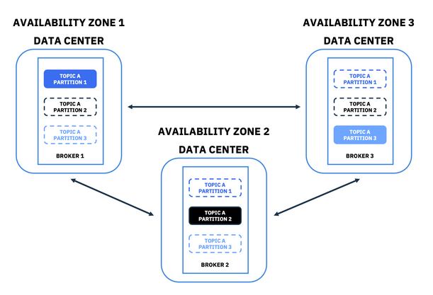
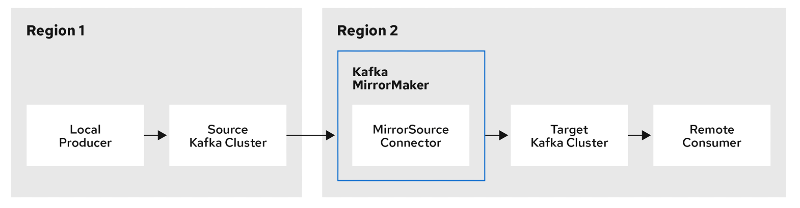

## Mirror Maker and disaster recovery

In order to create a disaster recovery (DR) plan you need to decide the recovery point objective (RPO), which is the maximum amount of data you are willing to risk losing, and the recovery time objective (RTO), which is the maximum amount of downtime that your system can have.
Zero RPO requires a really good infrastructure, but there are cheaper alternatives if you can relax this objective.
RTO depends on your tooling and failover procedures, since failing over applications is not a system responsibility.
A solid monitoring system can help with failure detection and to know what you have restored and what you might be missing.

A data corruption due to a human error or a bug would also be replicated In MirrorMaker, so having periodic backups from which you can restore the cluster at a specific point in time is a must in every case.
One strategy here is to backup the full cluster configuration, while also taking disk/volume snapshots.

Assuming you have set up your replication configuration correctly, the only way to have zero RPO is to setup a stretch Kafka cluster, which is one that evenly spans multiple data centers (DCs) with synchronous replication.
In order to do that, you would need at least three DCs with guaranteed low latency.
OpenShift supports stretch/multi-site clusters, so you can simply deploy Strimzi on top of that, using affinities rules to achieve the desired topology.
Then, you set rack awareness to ensure that replicas are distributed evenly across DCs and deploy Cruise Control with rack awareness goals to make sure that replicas remain distributed across different racks.

<p align="center"></p>

The cheaper alternative to the stretch cluster is using MirrorMaker 2 (MM2), where a passive/backup cluster is continuously kept in-sync, including consumer group offsets and topic ACLs.
You can also have active/active replication using MM2, which means your clients are distributed between two Kafka clusters resulting in a much more complex architecture.
This also works across regions, but you can't completely avoid duplicates and data loss, because the replication is asynchronous with no transactions support (KIP-656).
Producers should be able to re-send missing data, which means storing the latest sent messages somewhere, while consumers should be idempotent, so that they can tolerate some duplicates.
In case of disaster, the amount of data that may be lost depends on the latency of the MM2 connectors, so you should carefully monitor these metrics and set alerts.
It would also be good to have virtual hosts or a cluster proxy, so that you can switch all clients at once from a central place.

<p align="center"></p>

It is possible to combine stretch clusters and mirroring using MirrorMaker 2 to create a multi-region or even multi-cloud disaster recovery plan, where the service can survive a cloud outage (yes, a region can fail!).
After the failover phase, you can fail back once the original region is back online, or fail forward selecting another region as the new backup cluster (faster).
All disaster recovery processes should be documented in detail and carefully tested, simulating all possible scenarios such as partial failures.

<br/>

---
### Example: active-passive mirroring

First, we [deploy the Strimzi Cluster Operator and Kafka cluster](/sessions/001).

The following step copies the source CA certificate in the target namespace, where we will deploy MirrorMaker 2.
We can skip this step in this case, as it is only required when source and target clusters runs on different namespaces or Kubernetes clusters.

```sh
$ kubectl get secret "my-cluster-cluster-ca-cert" -o yaml \
  | yq "del(.metadata.namespace, .metadata.resourceVersion, .metadata.selfLink, .metadata.uid, .metadata.ownerReferences, .status)" \
  | kubectl -n target-namespace create -f -
secret/my-cluster-cluster-ca-cert created
```

At this point, we can deploy the target cluster and an MM2 instance.
The recommended way of deploying the MM2 is near the target Kafka cluster (same subnet or zone), because the producer overhead is greater than the consumer overhead.

```sh
$ for f in sessions/005/resources/*.yaml; do sed "s/SED_SOURCE/$NAMESPACE/g; s/SED_TARGET/$NAMESPACE/g" $f \
  | kubectl -n "$NAMESPACE" create -f -; done
kafka.kafka.strimzi.io/my-cluster created
kafkamirrormaker2.kafka.strimzi.io/my-mm2 created
configmap/mm2-metrics created
```

When the target cluster is up and running, we can start MM2 and check its status.
MM2 runs on top of Kafka Connect with a set of configurable built-in connectors.
The `MirrorSourceConnector` replicates remote topics, ACLs, and configurations of a single source cluster and emits offset syncs.
The `MirrorCheckpointConnector` emits consumer group offsets checkpoints to enable failover points.

```sh
$ kubectl -n "$NAMESPACE" scale kmm2 my-mm2 --replicas 1
kafkamirrormaker2.kafka.strimzi.io/my-mm2 scaled

$ kubectl -n "$NAMESPACE" get po
NAME                                              READY   STATUS    RESTARTS   AGE
my-cluster-entity-operator-7647f48d79-9xrbc   3/3     Running   0          11m
my-cluster-kafka-0                            1/1     Running   0          12m
my-cluster-kafka-1                            1/1     Running   0          12m
my-cluster-kafka-2                            1/1     Running   0          12m
my-cluster-zookeeper-0                        1/1     Running   0          13m
my-cluster-zookeeper-1                        1/1     Running   0          13m
my-cluster-zookeeper-2                        1/1     Running   0          13m
my-mm2-mirrormaker2-7c87647dcd-vdftr              1/1     Running   0          2m19s

$ kubectl -n "$NAMESPACE" get kmm2 my-mm2 -o yaml | yq '.status'
conditions:
  - lastTransitionTime: "2022-09-15T15:42:39.600109Z"
    status: "True"
    type: Ready
connectors:
  - connector:
      state: RUNNING
      worker_id: 10.128.2.65:8083
    name: my-cluster->my-cluster.MirrorCheckpointConnector
    tasks: []
    type: source
  - connector:
      state: RUNNING
      worker_id: 10.128.2.65:8083
    name: my-cluster->my-cluster.MirrorSourceConnector
    tasks:
      - id: 0
        state: RUNNING
        worker_id: 10.128.2.65:8083
      - id: 1
        state: RUNNING
        worker_id: 10.128.2.65:8083
    type: source
labelSelector: strimzi.io/cluster=my-mm2,strimzi.io/name=my-mm2-mirrormaker2,strimzi.io/kind=KafkaMirrorMaker2
observedGeneration: 2
replicas: 1
url: http://my-mm2-mirrormaker2-api.target.svc:8083
```

Finally, we can send 1 million messages to the test topic in the source Kafka cluster.
After some time, the log end offsets should match on both clusters.
Note that this is a controlled experiment, but the actual offsets tend to naturally diverge with time, because each Kafka cluster operates independently.
This is why we have offset mapping metadata.

```sh
$ kubectl-kafka bin/kafka-producer-perf-test.sh --topic my-topic --record-size 100 --num-records 1000000 \
  --throughput -1 --producer-props acks=1 bootstrap.servers=my-cluster-kafka-bootstrap:9092
1000000 records sent, 201531.640468 records/sec (19.22 MB/sec), 255.97 ms avg latency, 715.00 ms max latency, 185 ms 50th, 627 ms 95th, 687 ms 99th, 704 ms 99.9th.

$ kubectl-kafka bin/kubectl-kafka-class.sh kafka.tools.GetOffsetShell \
  --broker-list my-cluster-kafka-bootstrap:9092 --topic my-topic --time -1
my-topic:0:353737
my-topic:1:358846
my-topic:2:287417

$ kubectl-kafka bin/kubectl-kafka-class.sh kafka.tools.GetOffsetShell \
  --broker-list my-cluster-kafka-bootstrap."$NAMESPACE".svc:9092 --topic my-topic --time -1
my-topic:0:353737
my-topic:1:358846
my-topic:2:287417
```

<br/>

---
### Example: tuning for throughput

High-volume message generation, as seen in web activity tracking, can result in a large number of messages.
Additionally, even a source cluster with moderate throughput can create a significant volume of messages when mirroring large amounts of existing data.
In this case MM2 replication is slow even if you have a fast network, because default producers are not optimized for throughput.

Let's run a load test and see how fast we can replicate data with default settings.
In this case, ee set a small retention policy to avoid filling up the disk with our perf tests.
By looking at `MirrorSourceConnector` task metrics, we see that we are saturating the producer buffer (default: 16384 bytes) and creating a bottleneck.

```sh
$ kubectl -n "$NAMESPACE" scale kmm2 my-mm2 --replicas 0
kafkamirrormaker2.kafka.strimzi.io/my-mm2 scaled

$ kubectl patch kt my-topic --type merge -p '
    spec:
      config:
        retention.bytes: 1073741824'
kafkatopic.kafka.strimzi.io/my-topic patched

$ kubectl-kafka bin/kafka-producer-perf-test.sh --topic my-topic --record-size 100 --num-records 30000000 \
  --throughput -1 --producer-props acks=1 bootstrap.servers=my-cluster-kafka-bootstrap:9092
1047156 records sent, 209389.3 records/sec (19.97 MB/sec), 102.5 ms avg latency, 496.0 ms max latency.
...
30000000 records sent, 239285.970664 records/sec (22.82 MB/sec), 15.98 ms avg latency, 496.00 ms max latency, 3 ms 50th, 60 ms 95th, 115 ms 99th, 428 ms 99.9th.
pod "producer-perf" deleted

$ kubectl -n "$NAMESPACE" scale kmm2 my-mm2 --replicas 1
kafkamirrormaker2.kafka.strimzi.io/my-mm2 scaled

# took about 3 minutes
$ kubectl -n "$NAMESPACE" exec -it $(kubectl -n "$NAMESPACE" get po | grep my-mm2 | awk '{print $1}') -- bash -c '\
  for i in {1..100}; do /opt/kafka/bin/kubectl-kafka-class.sh kafka.tools.JmxTool --jmx-url service:jmx:rmi:///jndi/rmi://:9999/jmxrmi \
    --object-name kafka.producer:type=producer-metrics,client-id=\""connector-producer-my-cluster->my-cluster.MirrorSourceConnector-0\"" \
    --attributes batch-size-avg,request-latency-avg --date-format yyyy-MM-dd_HH:mm:ss --one-time true --wait \
      2>/dev/null | grep $(date +"%Y") && sleep 5; done'
2022-10-24_07:40:17,16193.412715517241,3.6808625336927223
2022-10-24_07:40:24,16239.756451806506,3.295798319327731
2022-10-24_07:40:32,16254.623251117842,3.024812463935372
2022-10-24_07:40:40,16261.989066279632,2.7141958583317205
2022-10-24_07:40:47,16265.681841394908,2.5584780388151174
2022-10-24_07:40:55,16267.953788740197,2.4651427238533983
2022-10-24_07:41:03,16269.49235385211,2.3892222813725015
2022-10-24_07:41:11,16277.0,2.1200891909110213
2022-10-24_07:41:19,16277.0,2.124041432986151
2022-10-24_07:41:27,16277.0,2.119467330906304
2022-10-24_07:41:35,16277.0,2.1087781172466116
2022-10-24_07:41:43,16277.0,2.132085932085932
2022-10-24_07:41:50,16277.0,2.109539547389648
2022-10-24_07:41:58,16277.0,2.1147420902152594
2022-10-24_07:42:06,16277.0,2.104702499088663
2022-10-24_07:42:13,16276.468756710328,2.0123094539468975
2022-10-24_07:42:19,16276.468756710328,2.0123094539468975
2022-10-24_07:42:26,16276.468756710328,2.0123094539468975
2022-10-24_07:42:33,16276.468756710328,2.0123094539468975
2022-10-24_07:42:39,16274.825131810194,1.3645147123407992
2022-10-24_07:42:46,16274.825131810194,1.3645147123407992
2022-10-24_07:42:53,16274.825131810194,1.3645147123407992
2022-10-24_07:43:00,16274.825131810194,1.3645147123407992
2022-10-24_07:43:06,16274.825131810194,1.3645147123407992
2022-10-24_07:43:13,NaN,NaN
```

When the replication is done (showing `NaN metrics` in the log), we increase the producer buffer by overriding its configuration.
Now every batch will include more data and the same test should complete the replications in about half of the time or even less.
Note how the request latency increases too, but it is still okay.
There is no free lunch, it's always a tradeoff between throughput and latency.

```sh
$ kubectl -n "$NAMESPACE" patch kmm2 my-mm2 --type merge -p '
  spec:
    mirrors:
      - sourceCluster: my-cluster
        targetCluster: my-cluster
        sourceConnector:
          config:
            replication.factor: -1
            offset-syncs.topic.replication.factor: -1
            refresh.topics.interval.seconds: 30
            sync.topic.acls.enabled: false
            replication.policy.separator: ""
            replication.policy.class: "org.apache.kafka.connect.mirror.IdentityReplicationPolicy"
            # high volumes: tune the producer for throughput (default x20)
            producer.override.batch.size: 327680'
kafkamirrormaker2.kafka.strimzi.io/my-mm2 patched

$ kubectl -n "$NAMESPACE" scale kmm2 my-mm2 --replicas 0
kafkamirrormaker2.kafka.strimzi.io/my-mm2 scaled

$ kubectl-kafka bin/kafka-producer-perf-test.sh --topic my-topic --record-size 100 --num-records 30000000 \
  --throughput -1 --producer-props acks=1 bootstrap.servers=my-cluster-kafka-bootstrap:9092
253179 records sent, 250585.7 records/sec (23.90 MB/sec), 15.5 ms avg latency, 324.0 ms max latency.
...
30000000 records sent, 241625.657423 records/sec (23.04 MB/sec), 9.02 ms avg latency, 324.00 ms max latency, 1 ms 50th, 44 ms 95th, 65 ms 99th, 84 ms 99.9th.

$ kubectl -n "$NAMESPACE" scale kmm2 my-mm2 --replicas 1
kafkamirrormaker2.kafka.strimzi.io/my-mm2 scaled

# took less than 2 minutes
$ kubectl -n "$NAMESPACE" exec -it $(kubectl -n "$NAMESPACE" get po | grep my-mm2 | awk '{print $1}') -- bash -c '\
  for i in {1..100}; do /opt/kafka/bin/kubectl-kafka-class.sh kafka.tools.JmxTool --jmx-url service:jmx:rmi:///jndi/rmi://:9999/jmxrmi \
    --object-name kafka.producer:type=producer-metrics,client-id=\""connector-producer-my-cluster->my-cluster.MirrorSourceConnector-0\"" \
    --attributes batch-size-avg,request-latency-avg --date-format yyyy-MM-dd_HH:mm:ss --one-time true --wait \
      2>/dev/null | grep $(date +"%Y") && sleep 5; done'
2022-10-24_08:25:34,114822.21625544268,3.096321393998064
2022-10-24_08:25:41,115199.66019845645,2.9993381866313698
2022-10-24_08:25:47,117026.9576514499,3.007466973004021
2022-10-24_08:25:54,117950.39076923077,2.9892826825127337
2022-10-24_08:26:01,119469.38660141749,3.000253164556962
2022-10-24_08:26:07,120710.9489424289,3.0178608951460393
2022-10-24_08:26:14,120531.58528009536,2.996602694004053
2022-10-24_08:26:21,120200.73555854087,2.96770526533354
2022-10-24_08:26:28,121498.74598787447,2.9101213852195644
2022-10-24_08:26:34,128486.59536263565,2.9788231616785183
2022-10-24_08:26:41,136136.2307097681,3.0344633563089043
2022-10-24_08:26:47,137990.7292217925,3.044473112438892
2022-10-24_08:26:54,137990.7292217925,3.044473112438892
2022-10-24_08:27:00,189254.9140625,3.4906398435317127
2022-10-24_08:27:07,189254.9140625,3.4906398435317127
2022-10-24_08:27:13,189254.9140625,3.4906398435317127
2022-10-24_08:27:20,189254.9140625,3.4906398435317127
2022-10-24_08:27:26,189254.9140625,3.4906398435317127
2022-10-24_08:27:32,NaN,NaN
```
