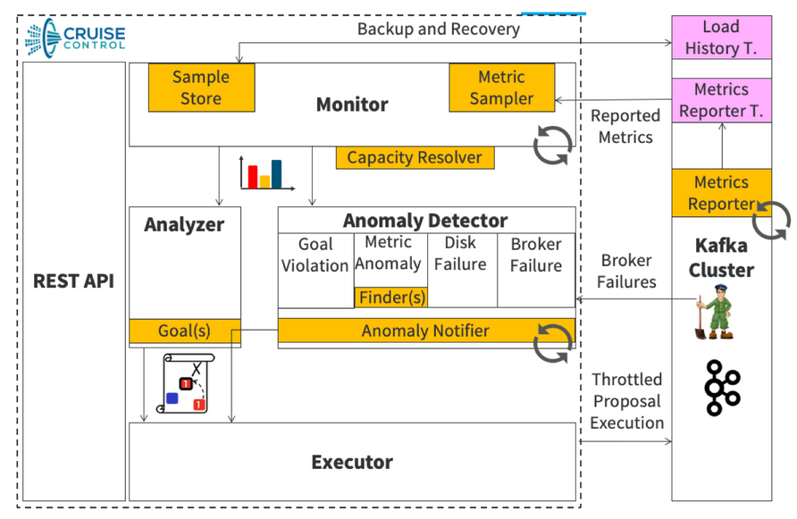

## Cruise Control and unbalanced clusters

By default, Kafka tries to distribute the load evenly across all brokers.
This is achieved through the concept of the preferred replica, which is the first replica created for a new topic.
The preferred replica is designated as the partition leader and assigned to a broker for balanced leader distribution.
A background thread moves the leader role to the preferred replica when it is in sync.

This may not be enough, and we may end up with uneven distribution of load across brokers as a consequence of broker failures, addition of new brokers or simply because some partitions are used more than others.
The `kafka.server:type=KafkaRequestHandlerPool,name=RequestHandlerAvgIdlePercent` metric is a good overall load metric for Kafka scaling and rebalancing decisions.
Below 0.7 (i.e. the request handler threads are busy 30% of the time) performance start to degrade, below 0.5 you start getting into trouble (scaling or rebalancing at this point adds even more load), and if you hit 0.3 it's barely usable for users.

The load is composed of various resources that brokers have in limited supply (CPU cycles, disk space, network bandwidth).
Rebalancing estimates the load imposed by each replica on a broker and tries to rearrange partition leaders and followers to get a better balance.
That rearrangement usually involves moving the data between different brokers (inter-broker rebalancing), same broker's disks (intra-broker reblancing), and changing partition leaders.
Doing this job using the `kafka-reassign-partitions.sh` tool is quite complicated, that's why [Cruise Control](https://github.com/linkedin/cruise-control) (CC) was created.

A replica workload model is periodically updated by the workload monitor using the resource utilization metrics from broker agents (CPU, disk, bytes-in, bytes-out).
The analyzer uses this model to create a valid rebalance proposal when possible (one that must satisfy all configured hard goals, and possibly soft goals).
The executor ensures that there is only one active rebalancing at any given time and applies changes in batches, enabling graceful cancellation.
If two equivalent changes are possible, the one with the lower cost is selected (leadership change > replica move > replica swap).

<p align="center"></p>

In order to have accurate rebalance proposals when using CPU goals, we can set CPU requests equal to CPU limits in `.spec.kafka.resources`.
That way, all CPU resources are reserved upfront (Guaranteed QoS) and Cruise Control can properly evaluate CPU utilization when generating the rebalance proposals.

<br/>

---
### Example: scaling up the cluster

First, [deploy the Strimzi Cluster Operator and Kafka cluster](/sessions/001).
When the cluster is ready, we want to scale it up and put some load on the new broker, which otherwise will sit idle waiting for new topic creation.
Thanks to the Cluster Operator, we can scale the cluster up by simply raising the number of broker replicas in the Kafka custom resource (CR).

```sh
$ kubectl patch k my-cluster --type merge -p '
    spec:
      kafka:
        replicas: 4'
kafka.kafka.strimzi.io/my-cluster patched

$ kubectl get po -l app.kubernetes.io/name=kafka
NAME                 READY   STATUS    RESTARTS   AGE
my-cluster-kafka-0   1/1     Running   0          3m41s
my-cluster-kafka-1   1/1     Running   0          6m17s
my-cluster-kafka-2   1/1     Running   0          5m4s
my-cluster-kafka-3   1/1     Running   0          2m30s
```

One option to put some load on the new broker is to use the `kafka-reassign-partitions.sh` tool to move existing data.
We only have one topic here, but you may have hundreds of them, where some of them are busier than others.
You would need a custom procedure to figure out which replica changes can be done in order to improve the balance, also considering available disk space and preferred replicas.
The result of this procedure would be a `reassign.json` file describing the desired partition state for each topic that we can pass to the tool.

```sh
$ kubectl run rebalancing -itq --rm --restart="Never" --image="quay.io/strimzi/kafka:latest-kafka-$KAFKA_VERSION" -- bash
[strimzi@rkc-1664115586 kafka]$ bin/kafka-topics.sh --bootstrap-server my-cluster-kafka-bootstrap:9092 --topic my-topic --describe
Topic: my-topic	TopicId: odTuFAweSkSLsboC-QQ4wg	PartitionCount: 3	ReplicationFactor: 3	Configs: min.insync.replicas=2,message.format.version=3.0-IV1,retention.bytes=1073741824
	Topic: my-topic	Partition: 0	Leader: 1	Replicas: 1,0,2	Isr: 1,2,0
	Topic: my-topic	Partition: 1	Leader: 0	Replicas: 0,2,1	Isr: 1,2,0
	Topic: my-topic	Partition: 2	Leader: 2	Replicas: 2,1,0	Isr: 1,2,0

[strimzi@rkc-1664115586 kafka]$ cat <<EOF >/tmp/reassign.json
{
  "version": 1,
  "partitions": [
    {"topic": "my-topic", "partition": 0, "replicas": [3, 2, 1]},
    {"topic": "my-topic", "partition": 1, "replicas": [2, 1, 3]},
    {"topic": "my-topic", "partition": 2, "replicas": [1, 3, 2]}
  ]
}
EOF

[strimzi@rkc-1664115586 kafka]$ bin/kafka-reassign-partitions.sh --bootstrap-server my-cluster-kafka-bootstrap:9092 \
  --reassignment-json-file /tmp/reassign.json --throttle 10000000 --execute
Current partition replica assignment

{"version":1,"partitions":[{"topic":"my-topic","partition":0,"replicas":[1,0,2],"log_dirs":["any","any","any"]},{"topic":"my-topic","partition":1,"replicas":[0,2,1],"log_dirs":["any","any","any"]},{"topic":"my-topic","partition":2,"replicas":[2,1,0],"log_dirs":["any","any","any"]}]}

Save this to use as the --reassignment-json-file option during rollback
Warning: You must run --verify periodically, until the reassignment completes, to ensure the throttle is removed.
The inter-broker throttle limit was set to 10000000 B/s
Successfully started partition reassignments for my-topic-0,my-topic-1,my-topic-2
```

To prevent any impact on the cluster while moving partitions between brokers, we use the `--throttle` option with a limit of 10 MB/s.
However, it's important to note that this option also applies to the normal replication traffic between brokers.
As a result, we need to find the right balance between the `--throttle` limit and the replication traffic to ensure that we can move data in a reasonable amount of time without slowing down replication too much.

We can start from a safe throttle value and then use the `kafka.server:type=FetcherLagMetrics,name=ConsumerLag,clientId=([-.\w]+),topic=([-.\w]+),partition=([0-9]+)` metric to observe how far the followers are lagging behind the leader for a given partition. 
If this lag is growing or the reassignment is taking too much time, we can run the command again with the `--additional` option to increase the throttle value.

After the reassignment is started, we use the `--verify` option to check the status of the reassignment process and disable the replication throttling, which otherwise will continue to affect the cluster.
When the process is done, we can check if the topic configuration changes have been applied.

```sh
[strimzi@rkc-1664115586 kafka]$ bin/kafka-reassign-partitions.sh --bootstrap-server my-cluster-kafka-bootstrap:9092 \
  --reassignment-json-file /tmp/reassign.json --verify
Status of partition reassignment:
Reassignment of partition my-topic-0 is complete.
Reassignment of partition my-topic-1 is complete.
Reassignment of partition my-topic-2 is complete.

Clearing broker-level throttles on brokers 0,1,2,3
Clearing topic-level throttles on topic my-topic

[strimzi@rkc-1664115586 kafka]$ bin/kafka-topics.sh --bootstrap-server my-cluster-kafka-bootstrap:9092 --topic my-topic --describe
Topic: my-topic	TopicId: odTuFAweSkSLsboC-QQ4wg	PartitionCount: 3	ReplicationFactor: 3	Configs: min.insync.replicas=2,message.format.version=3.0-IV1,retention.bytes=1073741824
	Topic: my-topic	Partition: 0	Leader: 3	Replicas: 3,2,1	Isr: 1,2,3
	Topic: my-topic	Partition: 1	Leader: 2	Replicas: 2,1,3	Isr: 1,2,3
	Topic: my-topic	Partition: 2	Leader: 1	Replicas: 1,3,2	Isr: 1,2,3

[strimzi@rkc-1664115586 kafka]$ exit
exit
```

<br/>

---
### Example: scaling up the cluster with CC

Let's repeat the cluster scale up example, but this time using Cruise Control to see how it helps with the planning phase.
Cruise Control can figure out by itself the required changes, given a set of high-level goals (sensible defaults are provided).

First, [deploy the Strimzi Cluster Operator and Kafka cluster](/sessions/001).
When the cluster is ready, we verify how the topic partitions are distributed between the available brokers.
Then we add one broker, deploy Cruise Control by adding the `.spec.cruiseControl` section to the Kafka CR and create a rebalance CR with `mode: add-brokers`.

```sh
$ kubectl-kafka bin/kafka-topics.sh --bootstrap-server my-cluster-kafka-bootstrap:9092 --topic my-topic --describe
Topic: my-topic	TopicId: n1QKre80QFmnEKWIXfrLDw	PartitionCount: 3	ReplicationFactor: 3	Configs: min.insync.replicas=2,message.format.version=3.0-IV1,retention.bytes=1073741824
	Topic: my-topic	Partition: 0	Leader: 2	Replicas: 2,1,0	Isr: 2,1,0
	Topic: my-topic	Partition: 1	Leader: 1	Replicas: 1,0,2	Isr: 1,0,2
	Topic: my-topic	Partition: 2	Leader: 0	Replicas: 0,2,1	Isr: 0,2,1

$ kubectl create -f sessions/007/resources \
  && kubectl patch k my-cluster --type merge -p '
    spec:
      kafka:
        replicas: 4'
kafkarebalance.kafka.strimzi.io/my-rebalance created       
kafka.kafka.strimzi.io/my-cluster patched

$ kubectl get po -l app.kubernetes.io/name=kafka
NAME                 READY   STATUS    RESTARTS   AGE
my-cluster-kafka-0   1/1     Running   0          3m41s
my-cluster-kafka-1   1/1     Running   0          6m17s
my-cluster-kafka-2   1/1     Running   0          5m4s
my-cluster-kafka-3   1/1     Running   0          2m30s
```

The first rebalance proposal generation takes some time because the workload model is created from scratch, then it is automatically refreshed every 15 minutes.
Before moving on, wait for the proposal to become ready.

```sh
$ kubectl get kr add-brokers -o wide -w
NAME          CLUSTER      PENDINGPROPOSAL   PROPOSALREADY   REBALANCING   READY   NOTREADY
add-brokers   my-cluster   True                                                    
add-brokers   my-cluster                     True                                  

$ kubectl get kr add-brokers -o yaml | yq '.status'
conditions:
  - lastTransitionTime: "2022-10-29T09:55:40.352012Z"
    status: "True"
    type: ProposalReady
observedGeneration: 1
optimizationResult:
  afterBeforeLoadConfigMap: add-brokers
  dataToMoveMB: 0
  excludedBrokersForLeadership: []
  excludedBrokersForReplicaMove: []
  excludedTopics: []
  intraBrokerDataToMoveMB: 0
  monitoredPartitionsPercentage: 100
  numIntraBrokerReplicaMovements: 0
  numLeaderMovements: 0
  numReplicaMovements: 44
  onDemandBalancednessScoreAfter: 80.87946050436929
  onDemandBalancednessScoreBefore: 76.41773549482696
  provisionRecommendation: ""
  provisionStatus: RIGHT_SIZED
  recentWindows: 1
sessionId: f0605d40-37be-43b9-be1f-83167633f37c
```

When the proposal is ready, we can approve it by using another annotation and wait for Cruise Control to move partitions and replica roles around.
When the rebalance is ready, we can look at the result and see if the new broker has picked some of the existing partitions.

From Strimzi 0.32, you can enable auto-approval by adding `strimzi.io/rebalance-auto-approval: "true"` as an annotation to the `KafkaRebalance` custom resource before you generate the proposal.

```sh
$ kubectl annotate kr add-brokers strimzi.io/rebalance=approve
kafkarebalance.kafka.strimzi.io/add-brokers annotated

$ kubectl get kr add-brokers -o wide -w
NAME          CLUSTER      PENDINGPROPOSAL   PROPOSALREADY   REBALANCING   READY   NOTREADY
add-brokers   my-cluster                                     True
add-brokers   my-cluster                                                   True

$ kubectl-kafka bin/kafka-topics.sh --bootstrap-server my-cluster-kafka-bootstrap:9092 --topic my-topic --describe
Topic: my-topic	TopicId: n1QKre80QFmnEKWIXfrLDw	PartitionCount: 3	ReplicationFactor: 3	Configs: min.insync.replicas=2,message.format.version=3.0-IV1,retention.bytes=1073741824
	Topic: my-topic	Partition: 0	Leader: 2	Replicas: 2,1,3	Isr: 2,1,3
	Topic: my-topic	Partition: 1	Leader: 1	Replicas: 1,3,2	Isr: 2,1,3
	Topic: my-topic	Partition: 2	Leader: 0	Replicas: 0,2,3	Isr: 0,2,3
```
