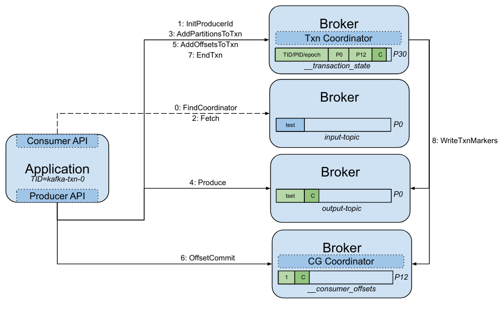

## Transactions and how to rollback

Kafka provides at-least-once semantics by default, so duplicates can arise because of producer retries or consumer restarts after failure.
The idempotent producer configuration (now default) solves the duplicates problem by creating a producer session identified by a producer id (PID) and an epoch.
A sequence number is assigned when the record batch is first added to a produce request and it is never changed, even if the batch is resent.
That way, the broker hosting the partition leader can identify and filter out duplicates.

Unfortunately, the idempotent producer does not guarantee atomicity when you need to write to multiple partitions as a single unit of work.
This is usually the case for read-process-write applications, where the exactly-once semantics (EOS) allow atomic writes to multiple partitions.
Transactions are only supported inside a single Kafka cluster, excluding any external system. 
If this is the requirement, you would need to use an additional component such as the Spring Transaction Manager.

<p align="center"></p>

Each producer instance must have its own static and unique `transactional.id` (TID), which is mapped to a producer id (PID) and epoch (to implement zombie fencing).
Consumers with `isolation.level=read_committed` only get committed messages, ignoring aborted transactions.

A given producer can have at most one ongoing transaction (ordering guarantee).
The transaction state is stored in an internal topic called `__transaction_state`.
The transaction coordinator automatically aborts any ongoing transaction that is not completed within `transaction.timeout.ms`.

A transaction goes through the following stages:

1. Undecided (ongoing)
2. Decided and unreplicated
3. Decided and replicated

Non-transactional batches are considered decided immediately, but transactional batches are only decided when the corresponding commit or abort marker is written (control record).
The high watermark (HW) is the offset of the last message that was successfully committed (replicated to all in-sync replicas).
The first unstable offset (FUO) is the earliest offset that is part of the ongoing transaction, if present.
The last stable offset (LSO) is the offset such that all lower offsets have been decided and it is always present.
The LSO is equal to the FUO if it's lower than the HW, otherwise it's the HW (LSO <= HW <= LEO).

The `LogCleaner` does not clean beyond the LSO.
If there is a hanging transaction on a partition (missing or out of order control record), the FUO can't be updated, which means the LSO is stuck.
At this point, transactional consumers can't make progress and compaction is blocked if enabled.
After transaction rollback, the LSO starts to increment again on every completed transaction.

<br/>

---
### Example: transactional application

First, we [deploy a Kafka cluster on localhost](/sessions/001).
We run the transactional application included in this example on a different terminal (there is a new poll/read every 60 seconds).
[Look at the code](/sessions/008/kafka-txn/src/main/java/it/fvaleri/example/Main.java) to see how the low-level transaction API is used.

```sh
$ export BOOTSTRAP_SERVERS="localhost:9092" INSTANCE_ID="kafka-txn-0" \
  GROUP_ID="my-group" INPUT_TOPIC="input-topic" OUTPUT_TOPIC="output-topic"

$ mvn clean compile exec:java -f sessions/008/kafka-txn/pom.xml -q
Starting instance kafka-txn-0
Created topics: input-topic
Waiting for new data
Waiting for new data
Processing records and sending downstream
Waiting for new data
```

Then, we send one sentence to the input topic and check the result from the output topic.

```sh
$ $KAFKA_HOME/bin/kafka-console-producer.sh --bootstrap-server :9092 --topic input-topic
>this is a test
>^C

$ $KAFKA_HOME/bin/kafka-console-consumer.sh --bootstrap-server :9092 --topic output-topic --from-beginning
tset a si siht
^CProcessed a total of 1 messages
```

Now we can stop the application (Ctrl+C) and take a look at partition content.
Our output topic has one partition, but what are the `__consumer_offsets` and `__transaction_state` coordinating partitions?
We can pass the `group.id` and `transactional.id` to find out.

```sh
$ kafka-cp my-group
12

$ kafka-cp kafka-txn-0
30
```

We now check what's happening inside all the partitions involved in this transaction.
In `output-topic-0`, we see that the data batch is transactional (`isTransactional`) and contains the PID and epoch.
This batch is followed by a control batch (`isControl`), which contains a single end transaction marker record (`endTxnMarker`).
In `__consumer_offsets-12`, the CG offset commit batch (`key: offset_commit`) is followed by a similar control batch.

```sh
$ $KAFKA_HOME/bin/kafka-dump-log.sh --deep-iteration --print-data-log --files /tmp/kafka-logs/output-topic-0/00000000000000000000.log
Dumping /tmp/kafka-logs/output-topic-0/00000000000000000000.log
Log starting offset: 0
baseOffset: 0 lastOffset: 0 count: 1 baseSequence: 0 lastSequence: 0 producerId: 0 producerEpoch: 0 partitionLeaderEpoch: 0 isTransactional: true isControl: false deleteHorizonMs: OptionalLong.empty position: 0 CreateTime: 1680383687941 size: 82 magic: 2 compresscodec: none crc: 2785707995 isvalid: true
| offset: 0 CreateTime: 1680383687941 keySize: -1 valueSize: 14 sequence: 0 headerKeys: [] payload: tset a si siht
baseOffset: 1 lastOffset: 1 count: 1 baseSequence: -1 lastSequence: -1 producerId: 0 producerEpoch: 0 partitionLeaderEpoch: 0 isTransactional: true isControl: true deleteHorizonMs: OptionalLong.empty position: 82 CreateTime: 1680383688163 size: 78 magic: 2 compresscodec: none crc: 3360473936 isvalid: true
| offset: 1 CreateTime: 1680383688163 keySize: 4 valueSize: 6 sequence: -1 headerKeys: [] endTxnMarker: COMMIT coordinatorEpoch: 0

$ $KAFKA_HOME/bin/kafka-dump-log.sh --deep-iteration --print-data-log --offsets-decoder --files /tmp/kafka-logs/__consumer_offsets-12/00000000000000000000.log
Dumping /tmp/kafka-logs/__consumer_offsets-12/00000000000000000000.log
Starting offset: 0
# ...
baseOffset: 1 lastOffset: 1 count: 1 baseSequence: 0 lastSequence: 0 producerId: 0 producerEpoch: 0 partitionLeaderEpoch: 0 isTransactional: true isControl: false deleteHorizonMs: OptionalLong.empty position: 339 CreateTime: 1665506597950 size: 118 magic: 2 compresscodec: none crc: 4199759988 isvalid: true
| offset: 1 CreateTime: 1680383688085 keySize: 26 valueSize: 24 sequence: 0 headerKeys: [] key: offset_commit::group=my-group,partition=input-topic-0 payload: offset=1
baseOffset: 2 lastOffset: 2 count: 1 baseSequence: -1 lastSequence: -1 producerId: 0 producerEpoch: 0 partitionLeaderEpoch: 0 isTransactional: true isControl: true deleteHorizonMs: OptionalLong.empty position: 457 CreateTime: 1665506597998 size: 78 magic: 2 compresscodec: none crc: 3355926470 isvalid: true
| offset: 2 CreateTime: 1680383688163 keySize: 4 valueSize: 6 sequence: -1 headerKeys: [] endTxnMarker: COMMIT coordinatorEpoch: 0
# ...
```

That was straightforward, but how is the transaction state managed by the coordinator? 
In `__transaction_state-20` record payloads, we can see all transaction state changes keyed by TID `kafka-txn-0` (we also have PID+epoch).
The transaction starts in the `Empty` state, then we have two `Ongoing` state changes (one for each partition registration).
Then, when the commit is called, we have `PrepareCommit` state change, which means the broker is now committed to the transaction.
This happens in the last batch, where the state is changed to `CompleteCommit`, terminating the transaction.

```sh
$ $KAFKA_HOME/bin/kafka-dump-log.sh --deep-iteration --print-data-log --transaction-log-decoder --files /tmp/kafka-logs/__transaction_state-30/00000000000000000000.log
Dumping /tmp/kafka-logs/__transaction_state-20/00000000000000000000.log
Log starting offset: 0
baseOffset: 0 lastOffset: 0 count: 1 baseSequence: -1 lastSequence: -1 producerId: -1 producerEpoch: -1 partitionLeaderEpoch: 0 isTransactional: false isControl: false deleteHorizonMs: OptionalLong.empty position: 0 CreateTime: 1680383478420 size: 122 magic: 2 compresscodec: none crc: 2867569944 isvalid: true
| offset: 0 CreateTime: 1680383478420 keySize: 17 valueSize: 37 sequence: -1 headerKeys: [] key: transaction_metadata::transactionalId=kafka-txn-0 payload: producerId:0,producerEpoch:0,state=Empty,partitions=[],txnLastUpdateTimestamp=1680383478418,txnTimeoutMs=60000
baseOffset: 1 lastOffset: 1 count: 1 baseSequence: -1 lastSequence: -1 producerId: -1 producerEpoch: -1 partitionLeaderEpoch: 0 isTransactional: false isControl: false deleteHorizonMs: OptionalLong.empty position: 122 CreateTime: 1680383687954 size: 145 magic: 2 compresscodec: none crc: 3735151334 isvalid: true
| offset: 1 CreateTime: 1680383687954 keySize: 17 valueSize: 59 sequence: -1 headerKeys: [] key: transaction_metadata::transactionalId=kafka-txn-0 payload: producerId:0,producerEpoch:0,state=Ongoing,partitions=[output-topic-0],txnLastUpdateTimestamp=1680383687952,txnTimeoutMs=60000
baseOffset: 2 lastOffset: 2 count: 1 baseSequence: -1 lastSequence: -1 producerId: -1 producerEpoch: -1 partitionLeaderEpoch: 0 isTransactional: false isControl: false deleteHorizonMs: OptionalLong.empty position: 267 CreateTime: 1680383687961 size: 174 magic: 2 compresscodec: none crc: 3698066654 isvalid: true
| offset: 2 CreateTime: 1680383687961 keySize: 17 valueSize: 87 sequence: -1 headerKeys: [] key: transaction_metadata::transactionalId=kafka-txn-0 payload: producerId:0,producerEpoch:0,state=Ongoing,partitions=[output-topic-0,__consumer_offsets-12],txnLastUpdateTimestamp=1680383687960,txnTimeoutMs=60000
baseOffset: 3 lastOffset: 3 count: 1 baseSequence: -1 lastSequence: -1 producerId: -1 producerEpoch: -1 partitionLeaderEpoch: 0 isTransactional: false isControl: false deleteHorizonMs: OptionalLong.empty position: 441 CreateTime: 1680383688149 size: 174 magic: 2 compresscodec: none crc: 1700234506 isvalid: true
| offset: 3 CreateTime: 1680383688149 keySize: 17 valueSize: 87 sequence: -1 headerKeys: [] key: transaction_metadata::transactionalId=kafka-txn-0 payload: producerId:0,producerEpoch:0,state=PrepareCommit,partitions=[output-topic-0,__consumer_offsets-12],txnLastUpdateTimestamp=1680383688148,txnTimeoutMs=60000
baseOffset: 4 lastOffset: 4 count: 1 baseSequence: -1 lastSequence: -1 producerId: -1 producerEpoch: -1 partitionLeaderEpoch: 0 isTransactional: false isControl: false deleteHorizonMs: OptionalLong.empty position: 615 CreateTime: 1680383688180 size: 122 magic: 2 compresscodec: none crc: 3020616838 isvalid: true
| offset: 4 CreateTime: 1680383688180 keySize: 17 valueSize: 37 sequence: -1 headerKeys: [] key: transaction_metadata::transactionalId=kafka-txn-0 payload: producerId:0,producerEpoch:0,state=CompleteCommit,partitions=[],txnLastUpdateTimestamp=1680383688154,txnTimeoutMs=60000
```

<br/>

---
### Example: transaction rollback

When there is a hanging transaction the LSO is stuck, which means that transactional consumers of this partition can't make any progress (CURRENT-OFFSET==LSO).

```sh
# application log
[Consumer clientId=my-client, groupId=my-group] The following partitions still have unstable offsets which are not cleared on the broker side: [__consumer_offsets-27], 
this could be either transactional offsets waiting for completion, or normal offsets waiting for replication after appending to local log

# consumer lag grows
$ $KAFKA_HOME/bin/kafka-consumer-groups.sh --bootstrap-server :9092 --describe --group my-group
GROUP     TOPIC                  PARTITION  CURRENT-OFFSET  LOG-END-OFFSET  LAG   CONSUMER-ID  HOST           CLIENT-ID
my-group  __consumer_offsets-27  9          913095344       913097449       2105  my-client-0  /10.60.172.97  my-client
```

If the partition is part of a compacted topic like `__consumer_offsets`, compaction is also blocked, causing unbounded partition growth.

```sh
# last cleaned offset never changes
$ grep "__consumer_offsets 27" /opt/kafka/data/kafka-0/cleaner-offset-checkpoint
__consumer_offsets 27 913095344
```

In Kafka 3+ there is an official command line tool that you can use to identify and rollback hanging transactions.
Note that the `CLUSTER_ACTION` operation is required if authorization is enabled.

```sh
$ $KAFKA_HOME/bin/kafka-transactions.sh --bootstrap-server :9092 find-hanging --broker 0
Topic                  Partition   ProducerId  ProducerEpoch   StartOffset LastTimestamp               Duration(s)
__consumer_offsets     27          171100      1               913095344   2022-06-06T03:16:47Z        209793

$KAFKA_HOME/bin/kafka-transactions.sh --bootstrap-server :9092 abort --topic __consumer_offsets --partition 27 --start-offset 913095344
```
