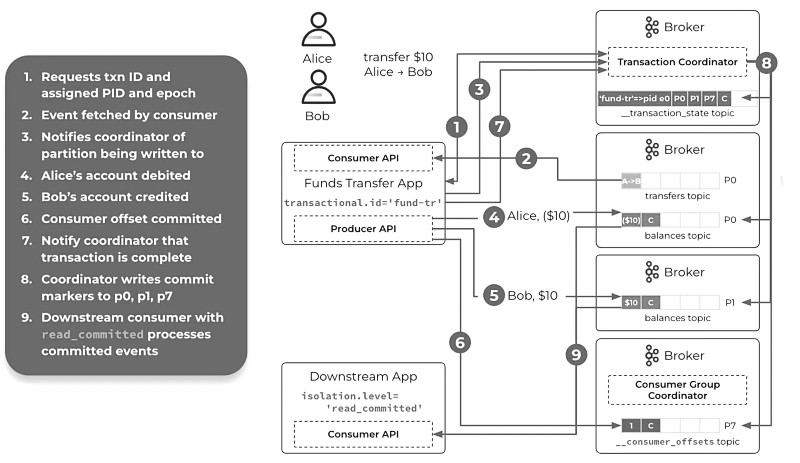

## Transactions and how to rollback them

Kafka provides at-least-once semantics by default and duplicates can arise due to either producer retries or consumer
restarts after failure. The **idempotent producer** configuration solves the duplicates problem, but does not guarantee
the atomicity when you need to write to multiple partitions at the same time. This is what a typical streaming
application does with its cycles of read-process-write. The **exactly-once semantics** (EOS) helps to achieve all or
nothing behavior when writing to multiple partitions, much like you need transactions to atomically write to two or more
tables in a relational database.


Algorithm overview:

1. Log the existence of an ongoing transaction to the `__transaction_state` coordinating partition.
2. Log the intent to commit or abort to the `__transaction_state` coordinating partition.
3. Log all the end transaction markers to the output and `__consumer_offsets` partitions.
4. Log the completion of the transaction to the `__transaction_state` coordinating partition.



The producer has to configure a static and unique `transactional.id` (TID), that is mapped to a producer ID (PID) and
epoch, used for zombie fencing. A producer can have **only one ongoing transaction** (ordering guarantee). Consumers
with `isolation.level=read_committed` receive committed messages only, ignoring ongoing and discarding aborted
transactions (they get few additional metadata to do that). Transactions overhead is minimal and the biggest impact is
on producers. You can balance overhead with latency by tuning the `commit.interval.ms`. Compared to suing the low level
API, enabling transactions is much easier when using the Streams API, as we just need to
set `processing.guarantee=exactly_once_v2`.

The **transaction state** is stored in a specific `__transaction_state` partition, whose leader is a broker called the
transaction coordinator. This partition is determined in a similar way as the consumer group coordinating partition.
Each partition also contains `.snapshot` logs which helps in rebuilding producers state in case of broker crash or
restart. A single Kafka transaction cannot span different Kafka clusters or external systems. The offset of the first
still-open transaction is called the **last stable offset** (LSO <= HW). The transaction coordinator automatically
aborts any ongoing transaction that is not committed or aborted within `transaction.timeout.ms`.

Before Kafka 2.5.0 the TID had to be a static encoding of the input partition (i.e. `my-app.my-group.my-topic.0`)
in order to avoid partition ownership transfer during consumer group rebalances, that would invalidate the fencing
logic. This was ugely inefficient, because you couldn't reuse a single thread-safe producer instance, but you needed to
create one for each input partition. This was fixed by forcing the producer to send the consumer group metadata along
with the offsets to commit.

### Example: word count with low level transaction API

[Deploy a Kafka cluster on localhost](/sessions/001). This time, we use a local deployment just because it's more
convenient for inspecting partition content. Let's run the application on a different shell, send one sentence to the
input topic and check the result on the output topic. [Look at the code](/sessions/008/kafka-trans) to see how the
transaction API is used within the read-process-write process.

```sh
$ kafka-topics.sh --bootstrap-server :9092 --create --topic wc-input --partitions 1 --replication-factor 1 \
  && kafka-topics.sh --bootstrap-server :9092 --create --topic wc-output --partitions 1 --replication-factor 1
Created topic wc-input.
Created topic wc-output.

$ pushd sessions/008/kafka-trans && mvn clean compile exec:java -q && popd
~/Documents/streams-debugging/sessions/008/kafka-trans ~/Documents/streams-debugging
Creating a new transactional producer
SLF4J: Failed to load class "org.slf4j.impl.StaticLoggerBinder".
SLF4J: Defaulting to no-operation (NOP) logger implementation
SLF4J: See http://www.slf4j.org/codes.html#StaticLoggerBinder for further details.
Creating a new transaction-aware consumer
READ: Waiting for new user sentence

$ kafka-console-producer.sh --bootstrap-server :9092 --topic wc-input
>All transactions should be rounded down if you ask me, but that's just my 0 cents.
>^C

$ kafka-console-consumer.sh --bootstrap-server :9092 --topic wc-output \
  --from-beginning --property print.key=true --property print.value=true
but	1
All	1
be	1
that's	1
my	1
transactions	1
down	1
0	1
cents.	1
me,	1
ask	1
should	1
rounded	1
just	1
if	1
you	1
^CProcessed a total of 16 messages
```

Now we can stop the application (Ctrl+C) and take a look at partitions content. Our topics have both one partition, so
we know where our records landed, but what about the internal `__consumer_offsets` and `__transaction_state`
coordinating partitions? Well, we can reuse the same tool we learned in the first session against the
configured `group.id` and `transactional.id`.

```sh
$ find_cp my-group
12

$ find_cp my-unique-static-tid
33
```

Let's now look inside all partitions we have written into as part of the single transaction. In `wc-output-0` dump we
see that the output batch is part of a transaction (`isTransactional: true`) and it is followed by a single-record
control batch (`isControl: true`) containing the end transaction marker (`endTxnMarker: COMMIT`). Also note the producer
id and epoch that have been generated with the init transaction API call. In the `__consumer_offsets-12` dump, the input
partition offset commit (`payload: offset=1`) record is also marked as transactional and followed by a similar end
transaction marker.

```sh
$ kafka-dump-log.sh --deep-iteration --print-data-log \
  --files /tmp/kafka-logs/wc-output-0/00000000000000000000.log
Dumping /tmp/kafka-logs/wc-output-0/00000000000000000000.log
Starting offset: 0
baseOffset: 0 lastOffset: 15 count: 16 baseSequence: 0 lastSequence: 15 producerId: 0 producerEpoch: 0 partitionLeaderEpoch: 0 isTransactional: true isControl: false deleteHorizonMs: OptionalLong.empty position: 0 CreateTime: 1664531387239 size: 256 magic: 2 compresscodec: none crc: 2340232627 isvalid: true
| offset: 0 CreateTime: 1664531387234 keySize: 3 valueSize: 1 sequence: 0 headerKeys: [] key: but payload: 1
| offset: 1 CreateTime: 1664531387238 keySize: 3 valueSize: 1 sequence: 1 headerKeys: [] key: All payload: 1
| offset: 2 CreateTime: 1664531387239 keySize: 2 valueSize: 1 sequence: 2 headerKeys: [] key: be payload: 1
| offset: 3 CreateTime: 1664531387239 keySize: 6 valueSize: 1 sequence: 3 headerKeys: [] key: that's payload: 1
| offset: 4 CreateTime: 1664531387239 keySize: 2 valueSize: 1 sequence: 4 headerKeys: [] key: my payload: 1
| offset: 5 CreateTime: 1664531387239 keySize: 12 valueSize: 1 sequence: 5 headerKeys: [] key: transactions payload: 1
| offset: 6 CreateTime: 1664531387239 keySize: 4 valueSize: 1 sequence: 6 headerKeys: [] key: down payload: 1
| offset: 7 CreateTime: 1664531387239 keySize: 1 valueSize: 1 sequence: 7 headerKeys: [] key: 0 payload: 1
| offset: 8 CreateTime: 1664531387239 keySize: 6 valueSize: 1 sequence: 8 headerKeys: [] key: cents. payload: 1
| offset: 9 CreateTime: 1664531387239 keySize: 3 valueSize: 1 sequence: 9 headerKeys: [] key: me, payload: 1
| offset: 10 CreateTime: 1664531387239 keySize: 3 valueSize: 1 sequence: 10 headerKeys: [] key: ask payload: 1
| offset: 11 CreateTime: 1664531387239 keySize: 6 valueSize: 1 sequence: 11 headerKeys: [] key: should payload: 1
| offset: 12 CreateTime: 1664531387239 keySize: 7 valueSize: 1 sequence: 12 headerKeys: [] key: rounded payload: 1
| offset: 13 CreateTime: 1664531387239 keySize: 4 valueSize: 1 sequence: 13 headerKeys: [] key: just payload: 1
| offset: 14 CreateTime: 1664531387239 keySize: 2 valueSize: 1 sequence: 14 headerKeys: [] key: if payload: 1
| offset: 15 CreateTime: 1664531387239 keySize: 3 valueSize: 1 sequence: 15 headerKeys: [] key: you payload: 1
baseOffset: 16 lastOffset: 16 count: 1 baseSequence: -1 lastSequence: -1 producerId: 0 producerEpoch: 0 partitionLeaderEpoch: 0 isTransactional: true isControl: true deleteHorizonMs: OptionalLong.empty position: 256 CreateTime: 1664531387382 size: 78 magic: 2 compresscodec: none crc: 3122996963 isvalid: true
| offset: 16 CreateTime: 1664531387382 keySize: 4 valueSize: 6 sequence: -1 headerKeys: [] endTxnMarker: COMMIT coordinatorEpoch: 0

$ kafka-dump-log.sh --deep-iteration --print-data-log --offsets-decoder \
  --files /tmp/kafka-logs/__consumer_offsets-12/00000000000000000000.log
Starting offset: 0
baseOffset: 0 lastOffset: 0 count: 1 baseSequence: -1 lastSequence: -1 producerId: -1 producerEpoch: -1 partitionLeaderEpoch: 0 isTransactional: false isControl: false deleteHorizonMs: OptionalLong.empty position: 0 CreateTime: 1664531116553 size: 339 magic: 2 compresscodec: none crc: 810578779 isvalid: true
| offset: 0 CreateTime: 1664531116553 keySize: 12 valueSize: 257 sequence: -1 headerKeys: [] key: group_metadata::group=my-group payload: {"protocolType":"consumer","protocol":"range","generationId":1,"assignment":"{consumer-my-group-1-75802c25-7e83-44cb-8249-a7d2e3197e32=[wc-input-0]}"}
baseOffset: 1 lastOffset: 1 count: 1 baseSequence: 0 lastSequence: 0 producerId: 0 producerEpoch: 0 partitionLeaderEpoch: 0 isTransactional: true isControl: false deleteHorizonMs: OptionalLong.empty position: 339 CreateTime: 1664531387354 size: 118 magic: 2 compresscodec: none crc: 2105801863 isvalid: true
| offset: 1 CreateTime: 1664531387354 keySize: 26 valueSize: 24 sequence: 0 headerKeys: [] key: offset_commit::group=my-group,partition=wc-input-0 payload: offset=1
baseOffset: 2 lastOffset: 2 count: 1 baseSequence: -1 lastSequence: -1 producerId: 0 producerEpoch: 0 partitionLeaderEpoch: 0 isTransactional: true isControl: true deleteHorizonMs: OptionalLong.empty position: 457 CreateTime: 1664531387381 size: 78 magic: 2 compresscodec: none crc: 1317242470 isvalid: true
| offset: 2 CreateTime: 1664531387381 keySize: 4 valueSize: 6 sequence: -1 headerKeys: [] endTxnMarker: COMMIT coordinatorEpoch: 0
baseOffset: 3 lastOffset: 3 count: 1 baseSequence: -1 lastSequence: -1 producerId: -1 producerEpoch: -1 partitionLeaderEpoch: 0 isTransactional: false isControl: false deleteHorizonMs: OptionalLong.empty position: 535 CreateTime: 1664531557631 size: 112 magic: 2 compresscodec: none crc: 3099282109 isvalid: true
| offset: 3 CreateTime: 1664531557631 keySize: 12 valueSize: 32 sequence: -1 headerKeys: [] key: group_metadata::group=my-group payload: {"protocolType":"consumer","protocol":null,"generationId":2,"assignment":"{}"}
```

That was straightforward, but how the transaction state is managed by the coordinator? In `__transaction_state-33` dump
we can see all transaction state changes for `my-unique-static-tid` contained in record payloads. The transaction starts
in `state=Empty`, then we have two `state=Ongoing` records where involved partitions are registered. When the
application calls commit, a `state=PrepareCommit` record is added and the broker is now doomed to commit, that is what
happens with the `state=CompleteCommit` record that closes the transaction.

```sh
$ kafka-dump-log.sh --deep-iteration --print-data-log --transaction-log-decoder \
  --files /tmp/kafka-logs/__transaction_state-33/00000000000000000000.log
Dumping /tmp/kafka-logs/__transaction_state-33/00000000000000000000.log
Starting offset: 0
baseOffset: 0 lastOffset: 0 count: 1 baseSequence: -1 lastSequence: -1 producerId: -1 producerEpoch: -1 partitionLeaderEpoch: 0 isTransactional: false isControl: false deleteHorizonMs: OptionalLong.empty position: 0 CreateTime: 1664531116250 size: 130 magic: 2 compresscodec: none crc: 1190815950 isvalid: true
| offset: 0 CreateTime: 1664531116250 keySize: 24 valueSize: 37 sequence: -1 headerKeys: [] key: transaction_metadata::transactionalId=my-unique-static-tid payload: producerId:0,producerEpoch:0,state=Empty,partitions=[],txnLastUpdateTimestamp=1664531116242,txnTimeoutMs=60000
baseOffset: 1 lastOffset: 1 count: 1 baseSequence: -1 lastSequence: -1 producerId: -1 producerEpoch: -1 partitionLeaderEpoch: 0 isTransactional: false isControl: false deleteHorizonMs: OptionalLong.empty position: 130 CreateTime: 1664531387243 size: 149 magic: 2 compresscodec: none crc: 3789373876 isvalid: true
| offset: 1 CreateTime: 1664531387243 keySize: 24 valueSize: 56 sequence: -1 headerKeys: [] key: transaction_metadata::transactionalId=my-unique-static-tid payload: producerId:0,producerEpoch:0,state=Ongoing,partitions=[wc-output-0],txnLastUpdateTimestamp=1664531387242,txnTimeoutMs=60000
baseOffset: 2 lastOffset: 2 count: 1 baseSequence: -1 lastSequence: -1 producerId: -1 producerEpoch: -1 partitionLeaderEpoch: 0 isTransactional: false isControl: false deleteHorizonMs: OptionalLong.empty position: 279 CreateTime: 1664531387247 size: 178 magic: 2 compresscodec: none crc: 1696269573 isvalid: true
| offset: 2 CreateTime: 1664531387247 keySize: 24 valueSize: 84 sequence: -1 headerKeys: [] key: transaction_metadata::transactionalId=my-unique-static-tid payload: producerId:0,producerEpoch:0,state=Ongoing,partitions=[__consumer_offsets-12,wc-output-0],txnLastUpdateTimestamp=1664531387246,txnTimeoutMs=60000
baseOffset: 3 lastOffset: 3 count: 1 baseSequence: -1 lastSequence: -1 producerId: -1 producerEpoch: -1 partitionLeaderEpoch: 0 isTransactional: false isControl: false deleteHorizonMs: OptionalLong.empty position: 457 CreateTime: 1664531387371 size: 178 magic: 2 compresscodec: none crc: 574508280 isvalid: true
| offset: 3 CreateTime: 1664531387371 keySize: 24 valueSize: 84 sequence: -1 headerKeys: [] key: transaction_metadata::transactionalId=my-unique-static-tid payload: producerId:0,producerEpoch:0,state=PrepareCommit,partitions=[__consumer_offsets-12,wc-output-0],txnLastUpdateTimestamp=1664531387371,txnTimeoutMs=60000
baseOffset: 4 lastOffset: 4 count: 1 baseSequence: -1 lastSequence: -1 producerId: -1 producerEpoch: -1 partitionLeaderEpoch: 0 isTransactional: false isControl: false deleteHorizonMs: OptionalLong.empty position: 635 CreateTime: 1664531387388 size: 130 magic: 2 compresscodec: none crc: 3610071080 isvalid: true
| offset: 4 CreateTime: 1664531387388 keySize: 24 valueSize: 37 sequence: -1 headerKeys: [] key: transaction_metadata::transactionalId=my-unique-static-tid payload: producerId:0,producerEpoch:0,state=CompleteCommit,partitions=[],txnLastUpdateTimestamp=1664531387373,txnTimeoutMs=60000
```

### Example: rollback hanging transactions

A hanging transaction is one which has a missing or an out of order control record due to a bug in the transaction
handling. If a transaction is being left in an open state, then the LSO is stuck, which means any `read_committed`
consumer of that partition cannot consume past that offset.

```sh
[Consumer clientId=my-client, groupId=my-group] The following partitions still have unstable offsets which are not cleared on the broker side: [my-topic-9], 
this could be either transactional offsets waiting for completion, or normal offsets waiting for replication after appending to local log
```

If there are producers sending messages to that partition, you should also see a growing consumer group lag. If the
stuck partition belongs to a compacted topic, you may also notice an unbounded partition growth. This happens because
the log cleaner select the partition with the highest dirty ratio (dirty entries / total entries) and never clean beyond
the LSO, so in this case that ratio remains constant and the partition is never cleaned.

```sh
$ TOPIC_NAME="my-topic" 
$ GID="my-group" 
$ LOG_DIR="/opt/kafka/data/kafka-0"

$ kafka-consumer-groups.sh --bootstrap-server :9092 --describe --group $GID
GROUP      TOPIC       PARTITION  CURRENT-OFFSET  LOG-END-OFFSET  LAG     CONSUMER-ID                                             HOST           CLIENT-ID
my-group   my-topic    3          18024190        18024191        1       my-client-8bhdz-1-81952d2b-1dd1-46f9-bd34-35526505026d  /10.60.172.88  my-client-8bhdz-1
my-group   my-topic    9          913095344       913097449       2115    my-client-ch5q6-1-c7c0ddd9-4d96-45f5-ad8e-738969005178  /10.60.172.97  my-client-ch5q6-1

# if it is a compacted topic, then you should also see that the last cleaned offset never changes
$ grep "$TOPIC_NAME $(coord_part $GID)" $LOG_DIR/cleaner-offset-checkpoint
my-topic 9 913090100
```

In such cases, the only way of fixing the issue is to rollback the hanging transaction. The challenge here is to
identify the parameters required to do so. As we saw earlier, Kafka provides a tool to dump partition segments, but
which one should I dump? We need a strategy and some tools to automate the tedious work of isolating the hanging
transaction.

First, dump the partition segment that includes the blocked/current offset and all snapshot files. You can easily
determine this segment inside the partition folder, because it is named after the first offset it contains. Note that it
is required to run these command inside the partition directory containing the row segments.

```sh
$ cd /path/to/my-topic-9
$ kafka-dump-log.sh --deep-iteration --files 00000000000912375285.log > 00000000000912375285.log.dump
$ kafka-dump-log.sh --deep-iteration --files 00000000000933607637.snapshot > 00000000000933607637.snapshot.dump
```

In order to automate the tedious work of isolating the hanging transaction, we created a tool called `klog`, which is
able to parse the segment dump produced as explained above and identify any open transaction. Here we first install that
tool and then we sue it to identify any `open_txn` and get its producer id and epoch.

```sh
$ git clone https://github.com/tombentley/klog $KAFKA_HOME/klog
$ pushd $KAFKA_HOME/klog && mvn clean package -DskipTests -Pnative -Dquarkus.native.container-build=true && popd 
$ cp $KAFKA_HOME/klog/target/*-runner $KAFKA_HOME/bin/klog

$ klog segment txn-stat 00000000000912375285.log.dump | grep "open_txn" > 00000000000912375285.log.dump.klog
```

If there is no `open_txn`, then it means that the retention kicked in and its records were deleted. In this case you can
simply delete all `.snapshot` files in the stuck partition's logs folder and do a cluster rolling restart. Otherwise,
you need to rollback the open transactions by using the Kafka command printed by `klog`. Note that the `CLUSTER_ACTION`
operation is required if authorization is enabled.

```sh
$ klog snapshot abort-cmd 00000000000933607637.snapshot.dump --pid 173101 --producer-epoch 14
```

As additional exercise, try to apply the above procedure to [this raw partition](/sessions/008/raw). We know
that `__consumer_offsets-27` LSO is 913095344 and some consumer applications are blocked. You should get the following
result for the first hanging transaction.

```sh
$KAFKA_HOME/bin/kafka-transactions.sh --bootstrap-server $BOOTSTRAP_URL abort --topic $TOPIC_NAME --partition $PART_NUM --producer-id 171100 --producer-epoch 1 --coordinator-epoch 34
```
